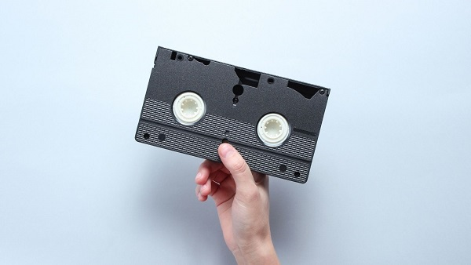
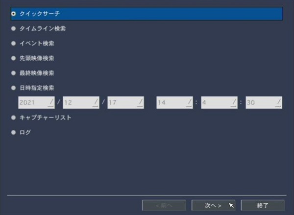

# 再生方法の種類と特徴

## はじめに
アイゼックのレコーダーでは録画したデーターの再生方法が複数ございます。用途に合わせて最適な再生方法を選択してください。
[[toc]]

## 再生方法の種類

録画の再生方法は以下の6つがあります。
- クイックサーチ
- タイムライン検索
- イベント検索
- 先頭映像検索
- 最終映像検索
- 日時指定検索

それぞれの再生方法の特徴を解説していきます。
## 各再生方法の特徴

- クイックサーチ
特徴：動画のサムネイル画像から再生する録画を選ぶことができる（１時間間隔～１秒間隔）
同時再生可能CH数：１

- タイムライン検索
特徴；タイムライン上で録画状態を確認でき、そのうえで再生するチャンネルを選ぶことができる
同時再生可能CH 数：複数

- イベント検索
特徴：イベント（＝録画方法）の種類から、再生する録画を選ぶことができる
同時再生できるCH数：１

- 先頭映像検索
特徴：HDDに保存されている一番古い録画データを再生できる
同時再生できるCH数：複数

- 最終映像検索
特徴：HDDに保存されている最新の映像を再生できる（直近３分間）
同時再生できるCH数：複数

- 日時指定検索
特徴：年月日分秒で録画日時を指定して再生することができる
同時再生できるCH数：複数

＜各再生方法の特徴まとめ＞

|    |  クイックサーチ | タイムライン検索 | イベント検索  |  先頭映像検索  |  最終映像検索  |  日時指定検索  |
| ---- | ---- | ---- | ---- | ---- | ---- | ---- |
|  特徴 |  動画のサムネイル画像から再生する録画を選ぶことができる（１時間間隔～１秒間隔）  |  タイムライン上で録画状態を確認でき、そのうえで再生するチャンネルを選ぶことができる  |  イベント（＝録画方法）の種類から、再生する録画を選ぶことができる  |  HDDに保存されている一番古い録画データを再生できる |  HDDに保存されている最新の映像を再生できる（直近３分間）  |  年月日分秒で録画日時を指定して再生することができる  |
| CH表示数  |  1  |  複数  |  1  |  複数  |  複数  |  複数  |

## それぞれの録画再生の仕方

それぞれの録画再生の方法は以下の記事を参考にしてください。

[録画の再生方法](./recorder-play02-howto.html)

**アイゼック最新のレコーダーはこちら▼**
- [【16ch同時再生, 4K対応機種】ANEモデル 製品ページ](https://isecj.jp/recorder/recorder-ane)

**レコーダーの導入事例を確認する▼**
- [多機能なデジタルレコーダーを使った導入事例](https://isecj.jp/case/security-enhancement)
- [マルチクライアントソフトの導入事例](https://isecj.jp/case/netcafe-camera)
- [レコーダー・センサー・警報機を連携した独自システムの構築事例](https://isecj.jp/case/system-design)
