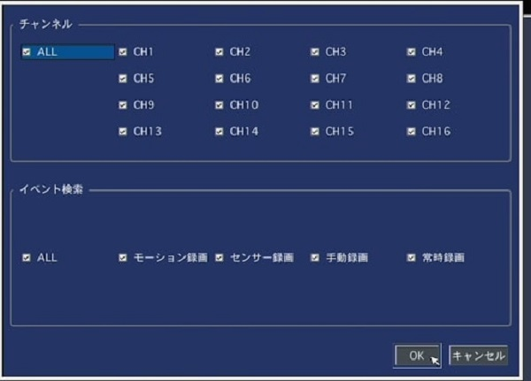

# 録画の再生方法

[[toc]]

## クイックサーチ
動画のサムネイル画像から再生する録画を選ぶことができます。（１時間間隔～１秒間隔）
- 検索画面に入り、クイックサーチを選択して「次へ」をクリックします。

- カレンダーが表示されるので、再生したいデータがある日付を選択し、「次へ」をクリックします。カレンダーの表示：録画データがある日付は青く、選択している日付は黄色の枠で強調されています。

- タイムラインが表示されるので、下のチャンネルの欄から該当のチャンネルを選択し「再生」クリックします。タイムライン表示：どのチャンネルが何時に録画されているかがわかります。

- 選択したチャンネルの１時間間隔のサムネイル画像が表示されます。任意の時間の画像をダブルクリックすることでその時間の２分３０秒間隔、１０秒間隔、１秒間隔へと間隔が短くなり、その時間の映像が再生されます。

## タイムライン検索
タイムライン上で録画状態を確認し、そのうえで再生するチャンネルを選ぶことができます。

検索画面に入り、タイムライン検索を選択し「次へ」をクリックします。

カレンダーが表示されるので、再生したいデータがある日付を選択し「次へ」をクリックします。カレンダーの表示：録画データがある日付は青く、選択している日付は黄色の枠で強調されています。

タイムラインが表示されるので、再生開始時間とチャンネルを指定して「再生」をクリックします。

再生開始時間の指定：

タイムスケール上の赤いスライドノブをドラッグアンドドロップします。

チャンネルの指定：

チャンネルの欄から希望のチャンネル番号を選択します。「ALL」を選択するとその時間帯に録画されているすべての録画が再生されます。

タイムライン画面の構成

- ①録画日時
左上に録画日時が表示されています。

- ②タイムスケール
時刻をあらわすスケールです。最初に表示されるスケールは3時間単位で24時間が表示されていますが、時計ボタンをクリックすることで10分単位で1時間が表示されるようになり、より細かい時間の設定ができるようになります。

- ③タイムライン
各チャンネルの録画データを表示しています。データがある時間帯は水色で表示されます。

- ④アイコンー(⏱)：
タイムスケールのメモリの単位を変更することができます。クリックすることで24時間⇔1時間に切り替わります。

## イベント検索

録画方法別で録画データを検索、再生することができます。

検索画面に入り、「イベント検索」を選択し「次へ」をクリックします。

カレンダーが表示されるので、再生したいデータがある日付を選択し「次へ」をクリックします。

カレンダーの表示：録画データがある日付は青く、選択している日付は黄色の枠で強調されています。
イベント検索画面に入るので、「↲」をクリックし、データを見つけたいチャンネル・イベント（録画方法）を選択します。

一覧に検索条件にあうチャンネルと録画方法が出てくるので、再生したいデータを選んで「再生」をクリックします。

 ### イベント検索画面の構成

- ①検索条件
現在条件として指定しているチャンネル数とイベント（録画方法）を表示しています。「↲」をクリックすることで条件を変更することができます。なおチャンネルとイベントはそれぞれ複数選択が可能です。

- ②ログ
検索条件にあてはまる録画の一覧が表示されています。「チャンネル」「ログ」「日付」をクリックすることでリストをそれぞれの項目ごとに整列できます。

- ③ページ
録画数が多数ある場合、ページが複数にわたるケースがあります。＜＞をクリックすると前／次のページを表示できます。

- ④バックアップ
検索されたログをtxt形式のファイルでUSBメモリーに保存します。USB端子にUSBメモリーを接続し、このボタンをクリックすると保存画面が表示されます。

## 先頭映像検索

HDDに保存されている一番古い録画データを再生できます。
検索画面に入り、先頭映像検索を選択し「再生」をクリックします。

## 最終映像検索

HDDに保存されている最新の映像（直近３分間）を再生できます。
検索画面に入り、最終映像検索を選択し「再生」をクリックします。

## 日時指定検索

年月日分秒で録画日時を指定して再生することができます。
検索画面に入り、日時指定検索を選択、年/月/日/分/秒の数値をいれ、「再生」をクリックします。

## その他検索画面の機能
- ログ：システムの動作・操作記録の閲覧ができます
検索メニューでログを選択し、「次へ」をクリックします。

カレンダーが表示されるので、検索したいログがある日付を選択し、「次へ」をクリックします。ログがリストで表示されます。

カレンダーの表示：システムログのある日付は水色、現在の選択日付は黄色の枠で強調されています。
- 保存の仕方

USB端子USBメモリーを接続し、システムログの表示画面の「バックアップ」ボタンをクリックします。リストはtxt形式でUSBに保存されます。

- キャプチャーリスト：ライブ・再生画面・静止画をキャプチャーした記録を検索・閲覧することができます。

検索画面に入り、キャプチャーリストを選択「次へ」をクリックします。

カレンダーが表示されるので、検索したいデータがある日付を選択し、「次へ」をクリックします。

カレンダーの表示：データのある日付は水色で現在の選択日付は黄色い枠で強調されています。

選択した日のキャプチャー映像がリストで表示されます。リストからログを選択し「表示」をクリックするとキャプチャー画像の確認やバックアップができます。

**アイゼック最新のレコーダーはこちら▼**
- [【16ch同時再生, 4K対応機種】ANEモデル 製品ページ](https://isecj.jp/recorder/recorder-ane)

**レコーダーの導入事例を確認する▼**
- [多機能なデジタルレコーダーを使った導入事例](https://isecj.jp/case/security-enhancement)
- [マルチクライアントソフトの導入事例](https://isecj.jp/case/netcafe-camera)
- [レコーダー・センサー・警報機を連携した独自システムの構築事例](https://isecj.jp/case/system-design)

<!-- ### キャプチャー画面の構成 

キャプチャーしたデータの静止画を表示します。

- ページ
キャプチャー画像が複数ある場合＜＞をクリックして前／次のキャプチャー画像を表示できます。
- キャプチャー情報
キャプチャーした際の情報を表示しています。キャプチャーしたチャンネル、バックアップの動画の長さ、録画データの日時、保存メディアなどの情報がみられます。 
- バックアップ
表示されているキャプチャーデータをさらにバックアップすることができます。USB端子にUSBメモリーを接続し、このボタンをクリックするとキャプチャーデータがUSBメモリに保存されます。この時の動画のキャプチャーデータは動画で、静止画のキャプチャーデータは静止画で保存されます。  -->

