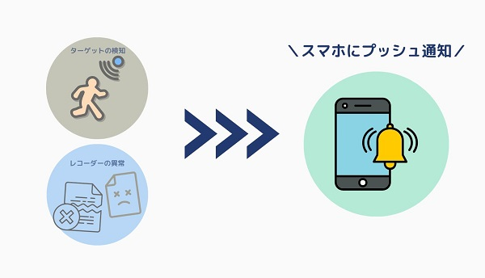
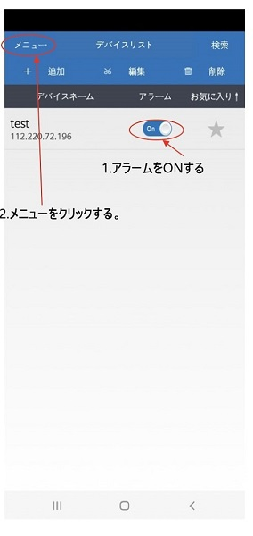
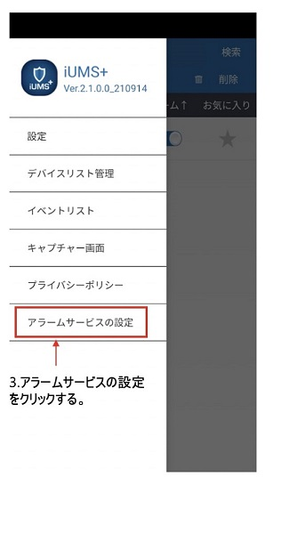
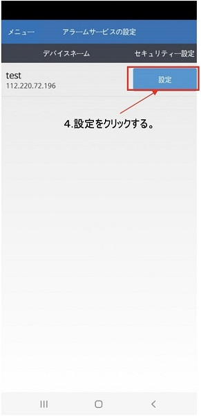
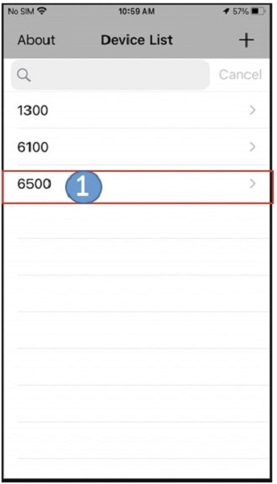
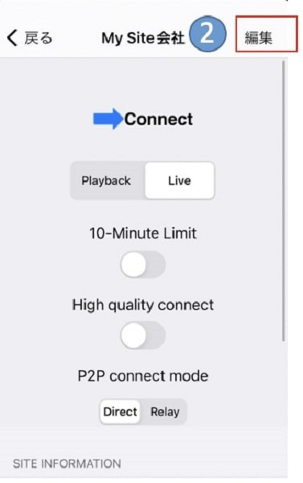
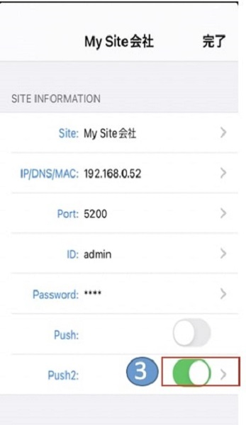
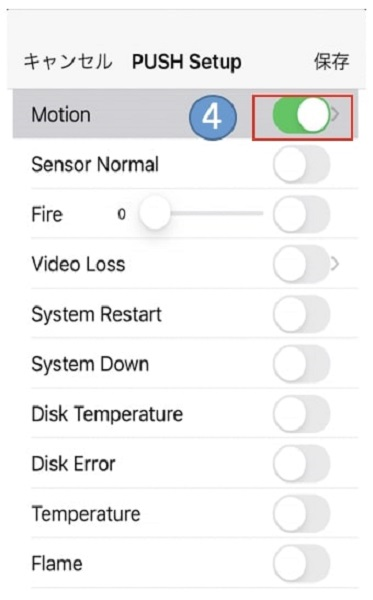
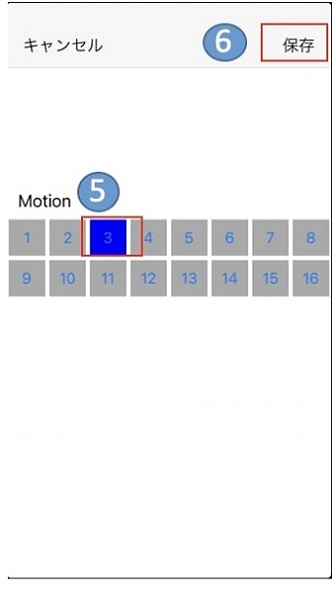
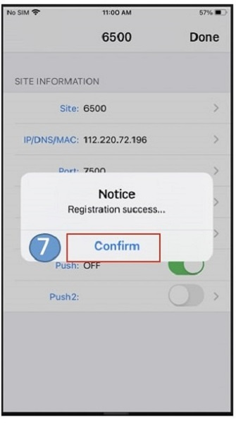

# 【ANEモデル以降】スマホへのプッシュ通知機能（iPhone, Android）

モーション検知が働いたときやセンサーの感知、レコーダーに異常（ビデオロスや再起動、HDD異常など）が起きた際、iPhoneやスマートフォンに通知を出すことが可能です。

**この機能はANEモデル以降のレコーダーに対応しています。**

[[toc]]

## アンドロイドでの設定方法

事前にスマホ用のUMSアプリをダウンロード、機器の接続を行なってください。

1. アプリを開き、通知を出したいデバイスのアラームを「ON」にします。
2. 画面左上の「メニュー」をクリックします。

3. メニューバーが開かれますので、「アラームサービスの設定」をクリックします。

4. アラームサービスの設定ページが開かれますので、「設定」をクリックします。 

5. スマホに通知が出せる項目の一覧が表示されますので、pushアラーム（通知）が必要な項目にチェックを入れます。
6. 「保存」をクリックし、設定を保存します。

## iOS の設定方法　
挿入写真は初稿のものだが、他社の写真の場合入れ替えが必要

モーション検知時にスマホへ通知する設定の手順を紹介いたします。
事前にiOS用のUMSアプリをダウンロード、機器の接続を行なってください。

1. Device Listの中から、通知を出したい機器を選択します。

2. 編集をクリックします。

3. Push2をOffかOnに変更して、反映されるまで少し待ちます。

4. ページが変わるので、MotionをONにします。
5. Motion検知が働いたらスマホへ通知するチャンネルを選択します。
 （本事例では３ｃｈを設定） 
 
6. 保存をクリックします。

7. ポップアップが表示されるのでcomfirmをクリックします。

**アイゼック最新のレコーダーはこちら▼**
- [【16ch同時再生, 4K対応機種】ANEモデル 製品ページ](https://isecj.jp/recorder/recorder-ane)

**レコーダーの導入事例を確認する▼**
- [多機能なデジタルレコーダーを使った導入事例](https://isecj.jp/case/security-enhancement)
- [マルチクライアントソフトの導入事例](https://isecj.jp/case/netcafe-camera)
- [レコーダー・センサー・警報機を連携した独自システムの構築事例](https://isecj.jp/case/system-design)
