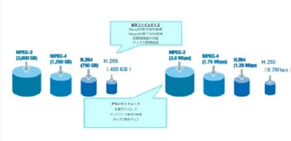
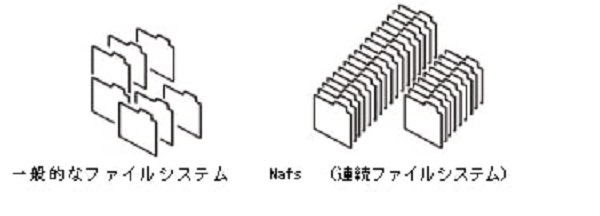
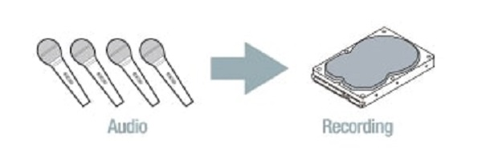
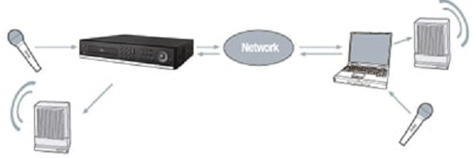

# 商品スペック（製品の特徴）

## 特徴

- すべてのビデオ入力が自動的にアナログ/960H/ AHD/HD-TVIを検出し、
レコーダー起動時に接続されているカメラを認識。  

- ANEシリーズは、アナログ、960HとAHD/HD-TVIなどの任意の入力を混在させることが可能。	   

- IPカメラに対応。  

- H.264/H.265ビデオ圧縮選択が可能。  

- スマート録画機能で少ないHDD使用量を可能にする、
信頼性の高いファイルシステムを採用。

- HDMI＆VGA及びCVBS出力   

- 4chオーディオ録音  

- 双 方向音声サポート

- チャンネル個別の操作 	

- 動き検出 （モーションディテクト）
 	
- ビデオ入力ロス検出 	 	
 	
- 強化されたセキュリティー	 	
 	
- PTZFカメラ制御 	RS-485及びPELCO-C
 	
- 簡単でシンプルなユーザインタフェース 	 	
 	
- 簡単なスケジューラ 	 	
 	
- 簡単なソフトウェアのアップグレード
 	
- USBフラッシュドライブ、ネットワークを介して敏速で便利なバックアップ 

- 排他的なファイル形式のバックアップ 	 	
 	
- bAVIファイルのバックアップ 	 	
 	
- Webベースのビューア、ネットワーククライアントソフトウェア、CMS、UMS（マルチサイト監視ソフト）とモバイルビューアー等でさまざまな方法によるネットワークにアクセス

**アイゼック最新のレコーダーはこちら▼**
- [【16ch同時再生, 4K対応機種】ANEモデル 製品ページ](https://isecj.jp/recorder/recorder-ane)
**レコーダーの導入事例を確認する▼**
- [多機能なデジタルレコーダーを使った導入事例](https://isecj.jp/case/security-enhancement)
- [マルチクライアントソフトの導入事例](https://isecj.jp/case/netcafe-camera)
- [レコーダー・センサー・警報機を連携した独自システムの構築事例](https://isecj.jp/case/system-design)