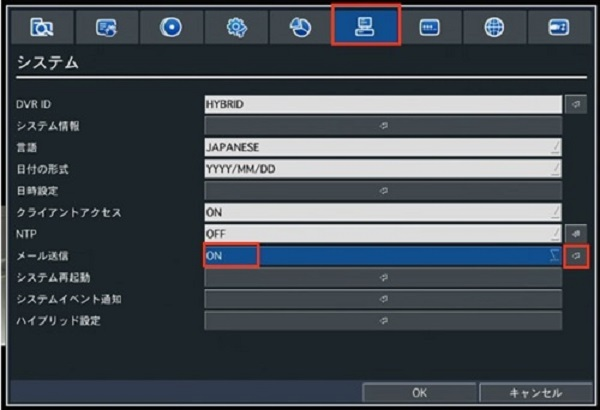
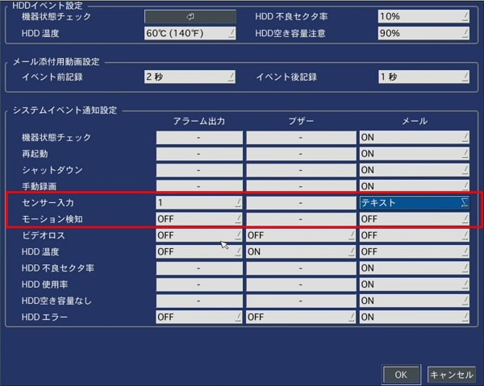
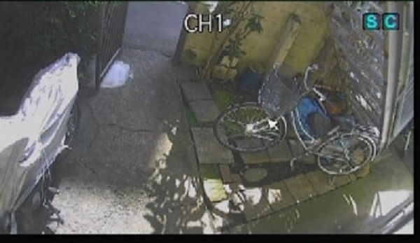
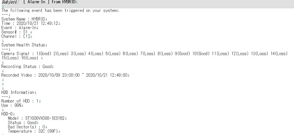

# モーション・センサー検知をメールで知らせる

メール送信を設定し、センサーやモーションが検知された際に、メールでテキストや動画を送ることができます。

## 設定手順

①設定のシステムに移動し、メール送信が「ON」になっているかを確認します。

「ONになっていない場合」
[メール送信の基本設定](./function04-mail.html)にお進みください。

システムイベント通知をクリックし、設定していきます。

②センサー検知の場合は「センサー入力」、モーション検知の場合は「モーション検知」のメールを設定していきます。

メールの種類はテキストまたは動画から選ぶことができます。
- テキスト・・イベント（センサー・モーション）を検知した際にテキストメールが送信される
- 動画・・イベント（センサー・モーション）を検知した際に動画ファイル付きメールが送信される

③メールの種類を選択後、「OK」をクリックします。

④設定完了です。

センサーが働くとCH１の右上に「S」と表記されます。
モーション検知が働くと右上に「M」を表記されます。

⑤設定完了後はモーション・センサーを有効にした撮影場所に立ち寄るなどして検知後にメールが届くか確認してください。

⑥メールが送信されると下記のようなメールが届きます。(テキストメールの場合)

**アイゼック最新のレコーダーはこちら▼**
- [【16ch同時再生, 4K対応機種】ANEモデル 製品ページ](https://isecj.jp/recorder/recorder-ane)

**レコーダーの導入事例を確認する▼**
- [多機能なデジタルレコーダーを使った導入事例](https://isecj.jp/case/security-enhancement)
- [マルチクライアントソフトの導入事例](https://isecj.jp/case/netcafe-camera)
- [レコーダー・センサー・警報機を連携した独自システムの構築事例](https://isecj.jp/case/system-design)