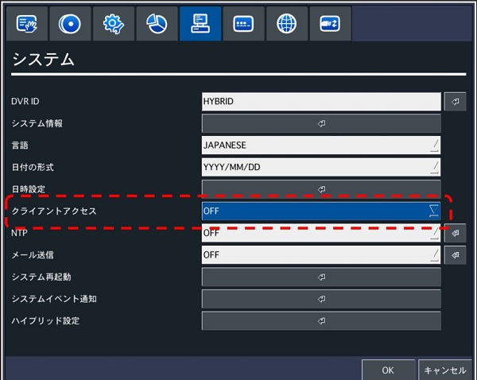
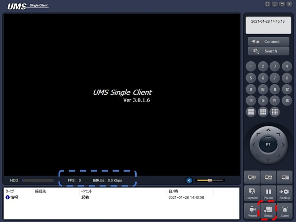
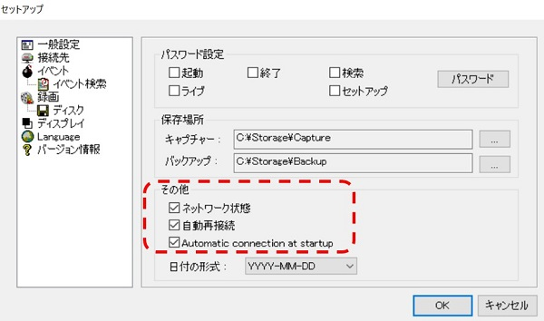

# UMSクライアントについて知りたい

[[toc]]

## イベント一覧

|イベントリスト|備考|
|----|----|
|接続失敗||
|リンク接続||
|リンク切断||
|録画OFF||
|録画ON||
|ネットワーク切断||
|パスワードが違います||
|ネットワーク接続||
|パスワード間違い||
|このIDでは、アクセスできません|DVR側でセキュリティ⇒使用者権限でネットワークのチェックマークを外したユーザーがアクセスした際に発報|
|DVR側で検索機能を使用中です|DVR側で録画映像を再生している状態でUMSで録画再生をしようとすると発報|
|他のPCから検索機能を使用中です|他のUMSアクセス者が録画映像を再生している状態でUMSで録画再生をしようとすると発報|
|DVR側のクライアントアクセス設定がOFFになっています|レコーダーの設定画面⇒システム⇒クライアントアクセスOFFにするとUMSで接続できません。※１下記図参照|
| Max client|UMSクライアントで４箇所以上から同時接続しようとした際に発報|
|%sに接続|%s : IPアドレス または DDNSアドレス|
|アラームON||
|アラームOFF||
|映像信号検知。Ch%d|%d : チャンネル番号|
|映像信号消失。Ch%d|%d : チャンネル番号|
|センサー入力 Ch-%d|%d : チャンネル番号|
|モーション検知 Ch-%d|%d : チャンネル番号|
|アラーム検知 Ch-%d|%d : チャンネル番号|

※１　 DVR側のクライアントアクセス設定

## UMS自動接続設定について
 
① UMSクライアントを立ち上げてSETUPをクリックするとポップアップ画面が表示されます。

② その他の設定

1. ネットワーク状態

ネットワーク状態にチェックを入れるとFPS やBitRateが表示されます。
表示される場所は上図の青枠箇所

2. 自動再接続

自動再接続にチェックを入れるとUMS起動中に通信が切れた際に自動で再接続を行います。

3. Automatic connection at startupというコマンドがあります

Automatic connection at startupにチェックを入れるとUMSを起動した際に、前回接続していたレコーダーに自動的に接続します。

**アイゼック最新のレコーダーはこちら▼**
- [【16ch同時再生, 4K対応機種】ANEモデル 製品ページ](https://isecj.jp/recorder/recorder-ane)

**レコーダーの導入事例を確認する▼**
- [多機能なデジタルレコーダーを使った導入事例](https://isecj.jp/case/security-enhancement)
- [マルチクライアントソフトの導入事例](https://isecj.jp/case/netcafe-camera)
- [レコーダー・センサー・警報機を連携した独自システムの構築事例](https://isecj.jp/case/system-design)