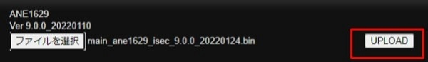

# UMSクライアント経由で遠隔からソフトバージョンをアップデートしたい

前段条件としてWEBポート（出荷時設定80)がポート開放されている必要があります。

①UMSクライアントでレコーダーに接続した状態で右クリックして出てくるポップアップから「遠隔設定」を選択

②ネットブラウザが立ち上がるので、ユーザー名（ID）とパスワードを入力

③WEB　SETUP画面が表示されるので上段メニューから「UPGRADE」を選択

④ファイル選択ボタンを押してファームウェアを選択

⑤ファイルが選択されるとファイル選択ボタンの横にファームウェアの名前がでます

⑥UPLOADボタンを押します。

(機種によってはUPGRADEボタン「画像」の場合もあります）

⑦そのまま20秒～1分程度待っていると画面が切り替わりタイムバーが表示されます。

⑧数分経過して画面が変わったら更新完了です。
更新中はブラウザを落とさないようにしてください。

⑨再度WEB　SETUP画面を表示し、上段メニューから「UPGRADE」を選択しメニューが
ソフトウェアバージョンが変わっていたらアップデート完了です。

**アイゼック最新のレコーダーはこちら▼**
- [【16ch同時再生, 4K対応機種】ANEモデル 製品ページ](https://isecj.jp/recorder/recorder-ane)

**レコーダーの導入事例を確認する▼**
- [多機能なデジタルレコーダーを使った導入事例](https://isecj.jp/case/security-enhancement)
- [マルチクライアントソフトの導入事例](https://isecj.jp/case/netcafe-camera)
- [レコーダー・センサー・警報機を連携した独自システムの構築事例](https://isecj.jp/case/system-design)
