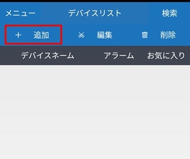

# Android版の操作方法

[[toc]]

スマートフォンからレコーダーの映像を確認するにはiUMS+が必要です。

この記事ではiUMS+の基本的な操作方法を説明します。

## レコーダーへの接続方法

アプリを起動するとデバイスリストが表示されます。

左上の「＋追加」をクリックし、接続先を追加します。

各種項目を入力後、保存をタップします。

- 接続先：接続先名を入力します。
- 接続先アドレス：レコーダーのIPアドレスまたはDDNSアドレスを入力します。
- ポート番号：レコーダーのポート番号を入力します。
- ユーザーID：レコーダーのIDを入力します。
- パスワード：レコーダーのパスワードを入力します。
- P2P Use：P2P接続をする時に使用します。

接続先一覧に入力した接続先が追加されます。

## 録画の見方

デバイスリストから接続先をタップし、レコーダーに接続します。

録画を見る場合は「再生」をタップします。

カレンダーから日付を選択し、カレンダー下のシークバーを動かし、再生する時間帯を選択します。

録画済の時間帯は水色で表示されます。

日付と時刻を決めたら「再生」をタップします。

録画映像が表示されます。

## 接続先の設定変更方法

デバイスリストの左にある「メニュー」をタップするとメニューが表示されます。

「設定」をタップし、設定画面を開きます。

各種設定をタップするとチェックマークがつき、設定が有効化されます。

- 10分後自動終了：ONにすると10分後にレコーダーとの接続が解除されます。
- 高画質接続：ONにすると高解像度で接続します。
- 画面比率を維持：映像のアスペクト比を維持します。
- 解像度の非表示：映像の解像度を非表示にします。

## 接続先の削除方法

接続先を削除する場合はデバイスリストの「削除」をタップします。

消したい接続先にチェックを入れ「削除」をタップすると接続先が削除されます。

## スクリーンショットの撮影方法

スクリーンショットを取る場合は接続語の画面で「キャプチャー」をタップするかスマートフォンのスクリーンショットを機能を使用してください。

「キャプチャー」機能を使用した場合、スクリーンショットはメニュー＞キャプチャー画面から確認できます。

## 録画の撮影方法

録画する場合はスマートフォンのスクリーン録画機能を使用してください。
