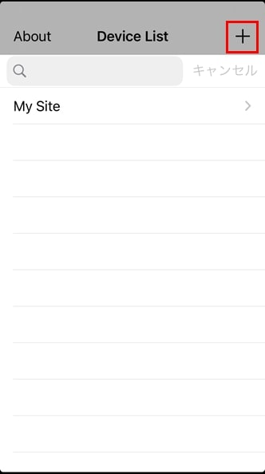
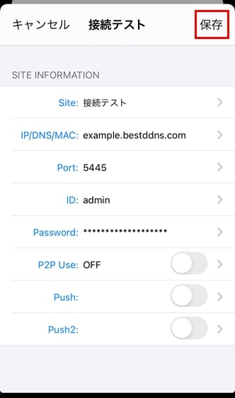
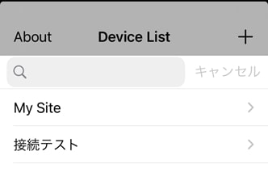
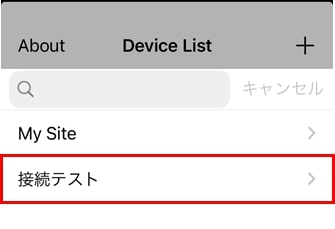
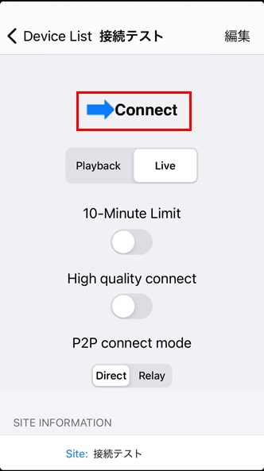
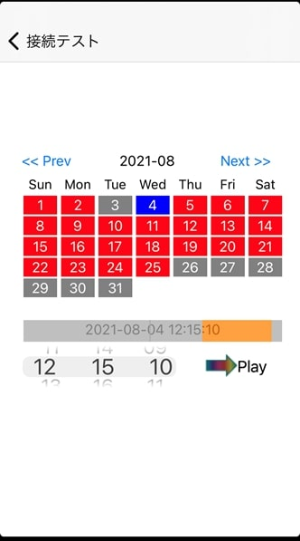
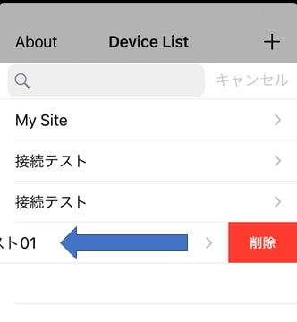

# iOS版の操作方法

[[toc]]

スマートフォンからレコーダーの映像を確認するにはiUMSが必要です。

この記事ではiOS版iUMSの基本的な操作方法を説明します。

## レコーダーへの接続方法
アプリを起動すると接続先一覧が表示されます。

右上の「＋」をクリックし、接続先を追加します。

各種項目を入力後、保存をタップします。

- Site：接続先名を入力します。
- IP/DNS/MAC：レコーダーのIPアドレスまたはDDNSアドレスを入力します。
- Port：レコーダーのポート番号を入力します。
- ID：レコーダーのIDを入力します。
- Password：レコーダーのパスワードを入力します。
- P2P Use：P2P接続をする時に使用します。
- Push：使用しません。
- Push2：使用しません。

接続先一覧に入力した接続先が追加されます。

## ライブビュー、録画の見方
接続先一覧から接続先をタップします。

ライブビューを見る場合は「Live」を選択し、「Connect」をタップします。

録画を見る場合は「Playback」を選択し、「Connect」をタップします。

- 10-Minute Limit：ONにすると10分後に接続が解除されます。
- High quality connect：ONにすると高解像度で接続します。
- P2P connect mode：リレーサーバを使用して接続する場合は「Relay」を選択します。

### 録画を選択した場合

「Playback」（録画）を選択し、「Connect」を押した場合は日時指定画面が表示されます。

カレンダーから日付を選択し、左下の時刻を選択したら「Play」をタップします。

## 接続先の削除方法

接続先を削除する場合は接続先一覧から消したい接続先を左にスワイプします。

スワイプすると削除が表示されます。

削除をタップすると接続先が削除されます。

## スクリーンショットや録画の方法

iUMSにスクリーンショット撮影機能や録画機能はありません。

スマートフォンのスクリーンショット機能やスクリーン録画機能で代用してください。
