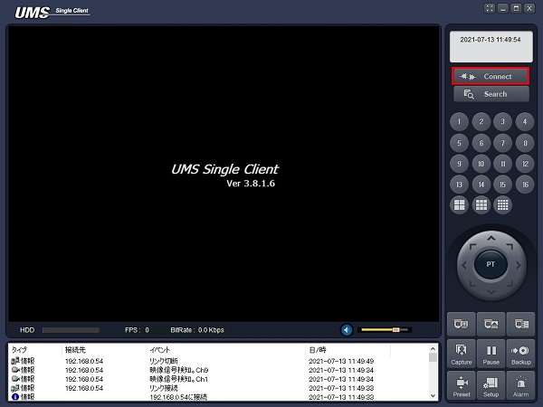

# レコーダーに接続する

[[toc]]

## はじめに

PC でレコーダーの映像を確認するには UMS クライアントが必要です。

ローカルネットワーク（レコーダーと PC が同じネットワークに接続されている）から接続する場合と

インターネットから（別の事業所からレコーダーに接続する）接続する場合では設定が異なります。

以下の手順に従って接続してください。

## ローカルネットワークから接続する

レコーダーの設定＞ネットワークから IP アドレスとポート番号を確認します。


UMS クライアントを立ち上げ、Connect をクリックします。



接続設定を入力し、OK をクリックします。

- モデル：DVR/NVR を選択します。
- 接続先名：使用しません。
- 接続先アドレス：レコーダーの IP アドレスを入力します。
- ポート番号：レコーダーのポート番号を入力します。
- ID：レコーダーの ID を入力します。初期値は「admin」です。
- パスワード：レコーダーに設定したパスワードを入力します。


レコーダーとの接続が完了したら一覧画面が表示されます。


## インターネットから接続する

インターネットから接続する場合はレコーダーの DDNS 設定を確認してください。

設定＞ネットワーク＞ DDNS の矢印ボタンをクリックします。


DDNS サーバー名が「bestddns.com」になっているか確認してください。


レコーダーの DDNS 設定を確認したら

UMS クライアントを立ち上げ、Connect をクリックします。


接続設定を入力し、OK をクリックします。

- モデル：DVR/NVR を選択します。
- 接続先名：使用しません。
- 接続先アドレス：レコーダーの DDNS アドレスを入力します。
- ポート番号：レコーダーのポート番号を入力します。
- ID：レコーダーの ID を入力します。初期値は「admin」です。
- パスワード：レコーダーに設定したパスワードを入力します。


レコーダーとの接続が完了したら一覧画面が表示されます。


## DDNS アドレスがわからない・未設定の場合

弊社のレコーダーをご購入いただいたお客様には無料で DDNS アドレスを提供しています。

DDNS アドレスがわからない・未設定の場合は

レコーダーの設定＞システム＞システム情報をクリックします。


レコーダーの設定＞システム＞システム情報から「モデル名」、「MAC アドレス」をメモした上で


[問い合わせフォーム](https://isecj.jp/contact/?subject=DDNS%E3%81%AB%E9%96%A2%E3%81%99%E3%82%8B%E5%95%8F%E3%81%84%E5%90%88%E3%82%8F%E3%81%9B)からご連絡お願いします。

連絡には以下のテンプレートをご活用ください。

#### DDNS アドレスがわからない場合

```
お世話になっております。
〇〇株式会社　〇〇と申します。

以下の機種のDDNSアドレスを教えてください。
機種名：XXX-XXX
MACアドレス：XX:XX:XX:XX:XX:XX
```

#### DDNS アドレス登録申請の場合

```
お世話になっております。
〇〇株式会社　〇〇と申します。

以下の機種のDDNSアドレスの登録をお願いします。
機種名：XXX-XXX
MACアドレス：XX:XX:XX:XX:XX:XX
```
