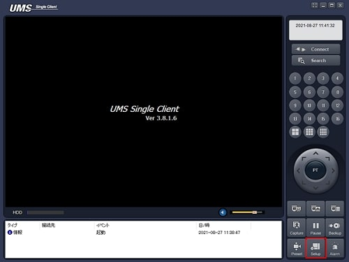
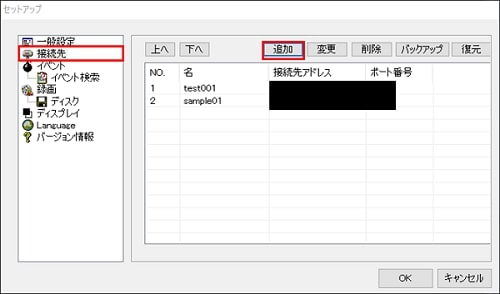
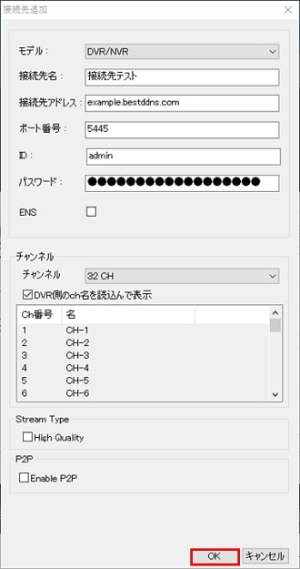
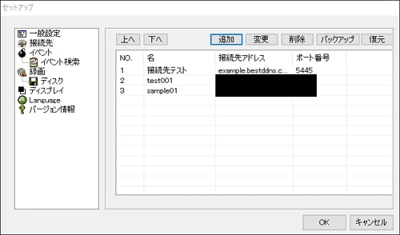
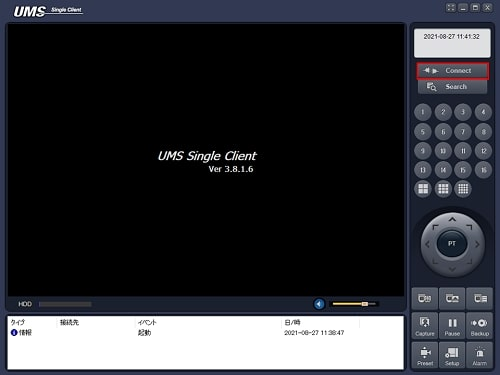
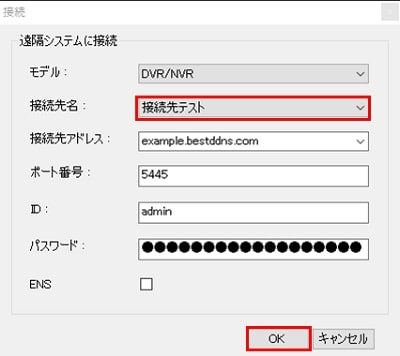

# 接続先登録

[[toc]]

UMSクライアントでレコーダーに接続する場合、IDやパスワードなど少なくとも4項目を入力する必要があります。接続先登録機能を使えば各項目を自動で入力できます。

## 接続先登録方法
Setupをクリックします。

接続先をクリックし、追加をクリックします。

各種設定を入力し、OKをクリックします。

- モデル：DVR/NVRを選択します。
- 接続先名：接続先名を入力します。
- 接続先アドレス：レコーダーのIPアドレスまたはDDNSアドレスを入力します。
- ポート番号：レコーダーのポート番号を入力します。
- ID：レコーダーのIDを入力します。
- パスワード：レコーダーのパスワードを入力します。

入力が完了すると接続先一覧に追加されます。OKをクリックし、ウィンドウを閉じます。

レコーダーに接続する時はConnectをクリックします。

接続先名を選択すると各項目が自動的に入力されます。
OKをクリックするとレコーダーに接続します。

以上で接続先登録の方法は終わりです。
