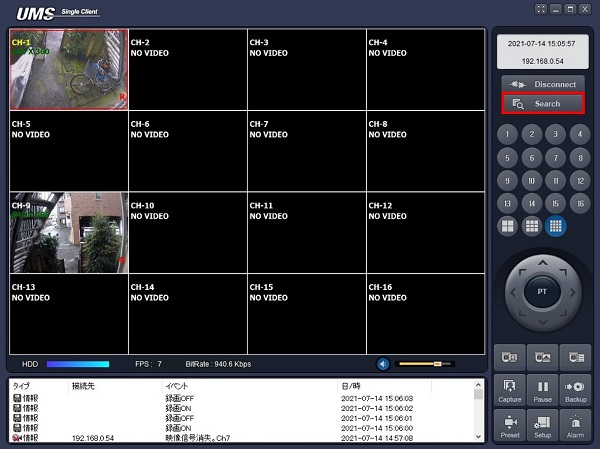
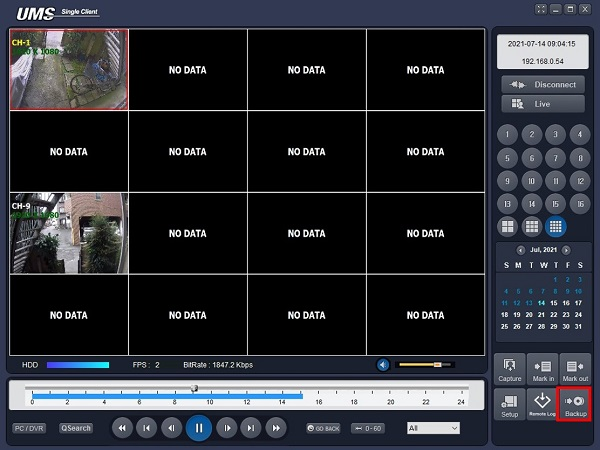
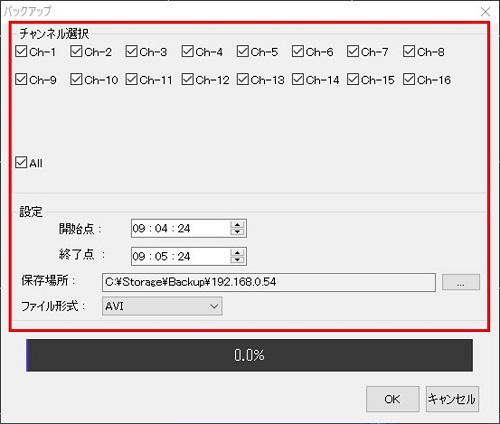
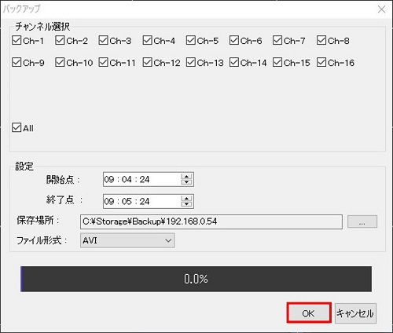

# 動画を保存する

[[toc]]

Searchボタンをクリックし、Search画面に移ります。

Backupボタンをクリックします。

各種設定を入力します。

- チャンネル選択：保存するチャンネルにチェックを入れます。
- 開始点：録画の開始時刻です。
- 終了点：録画の終了時刻です。
- 保存場所：ファイルを保存する場所を決めます。
- ファイル形式：AVIを選択します。

設定の入力が完了したらOKをクリックします。

これで動画の保存は完了です。