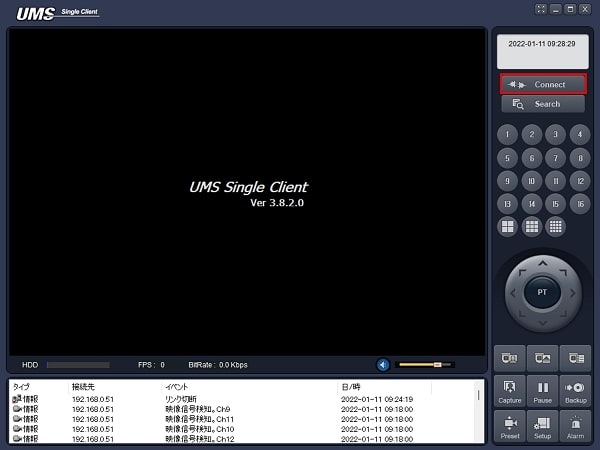
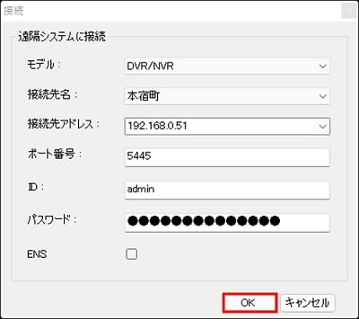
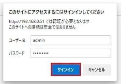
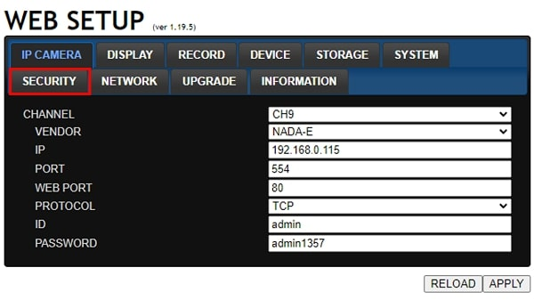
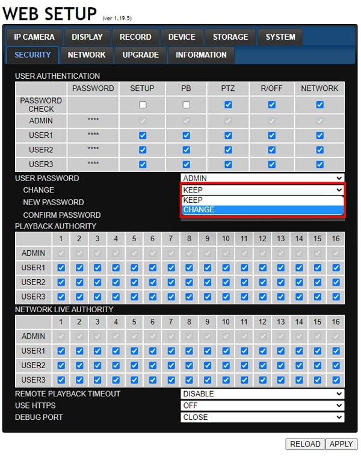
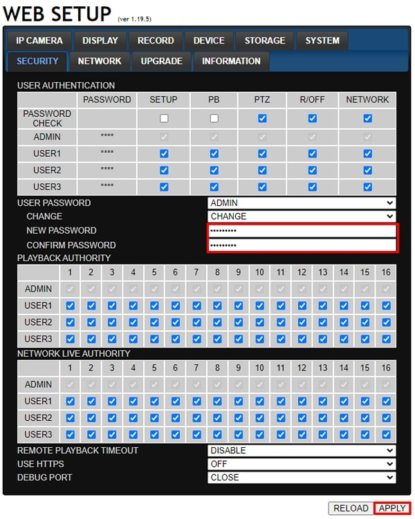
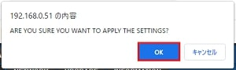
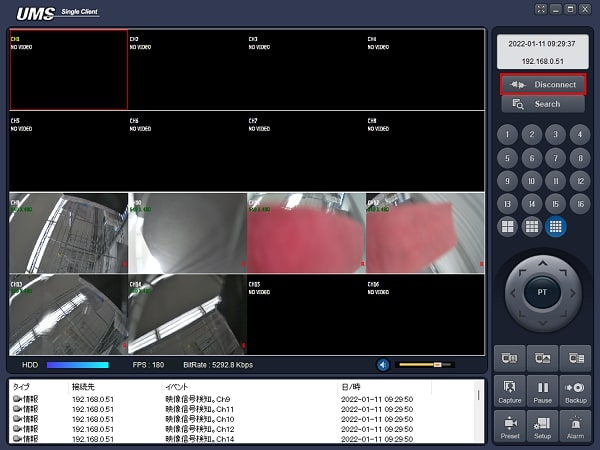

# レコーダーのパスワードを変更する

[[toc]]

## UMSからレコーダーの設定画面を開く

UMSを立ち上げ、Connectをクリックします。

以下の項目を入力し、OKをクリックし、レコーダーに接続します。
- モデル：DVR／NVR
- 接続先アドレス：レコーダーのIPアドレス
- ポート番号：レコーダーのポート番号
- ID：admin
- パスワード：レコーダーのパスワード

レコーダーに接続したら、画面を右クリックし、遠隔設定をクリックします。

## レコーダーの設定画面からパスワードを変更する。

ウェブブラウザが立ち上がります。

ユーザー名とパスワードを入力し、サインインをクリックします。
- ユーザー名：admin
- パスワード：レコーダーのパスワード

レコーダーの管理画面にログインしたらSECURITYタブをクリックします。

CHANGEのプルダウンメニューからCHANGEを選択します。

新しいパスワードと確認用パスワードを入力し、APPLYをクリックします。
- NEW PASSWORD：新しいパスワードを入力する
- CONFIRM PASSWORD：新しいパスワードをもう一度入力する

確認ダイアログが表示されます。
OKをクリックします。

これでパスワード変更は完了です。

## パスワード変更後に設定画面にログインする方法

パスワード変更後にレコーダーの設定画面にログインする場合はUMSのDisconnectをクリックし、レコーダーとの通信を切断します。

通信を切断したら「UMSからレコーダーの設定画面を開く」の手順と同様にConnectをクリックし、レコーダーに接続し、右クリックから遠隔設定を選択することで設定画面にログインできます。

