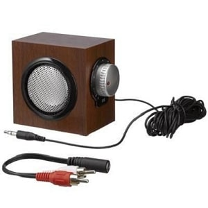
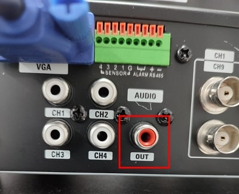
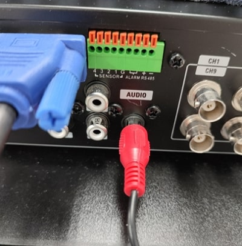
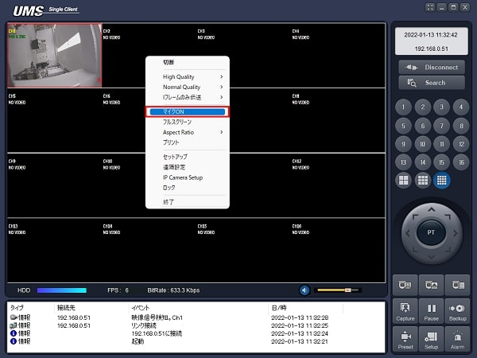
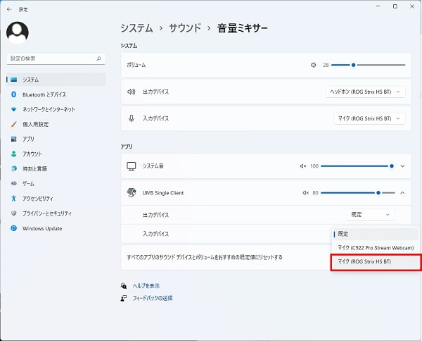

# UMSからレコーダーにマイク出力する

[[toc]]

## PC側の準備

PCにマイクを接続します。

## レコーダー側の準備

レコーダーのAUDIO OUTにRCAケーブルとスピーカーを接続します。

## マイク出力方法

UMSを立ち上げ、レコーダーに接続します。

画面を右クリックし、マイクONをクリックします。

レコーダーに接続したスピーカーから音声が流れます。

## 音が出ない場合の対処方法

### PCの設定
設定＞システム＞サウンド＞音量ミキサー＞アプリ＞UMS Single Clientの出力デバイスを確認してください。

既定を選択すると音声が出力されない可能性があります。出力するマイクを選択してください。

### レコーダーの設定

レコーダーのAUDIO OUTにスピーカーが接続されているか確認してください。

スピーカーの電源が入っているか、音量が0になっていないか確認してください。