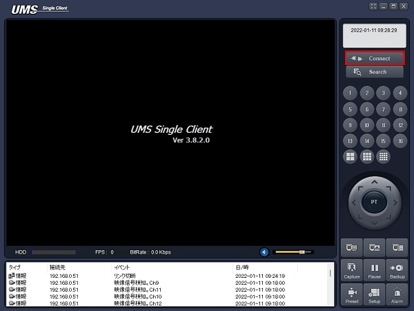
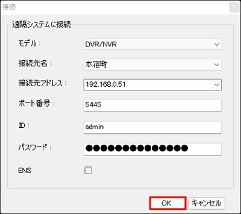
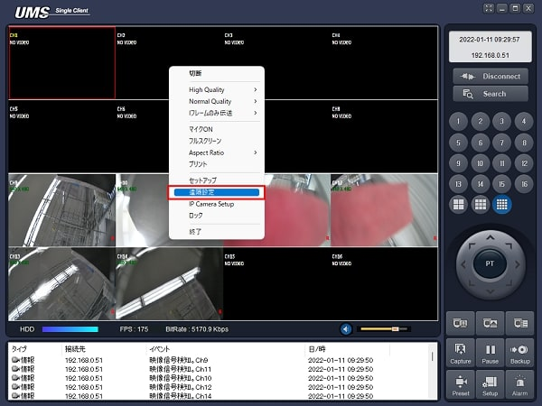
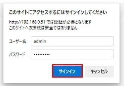
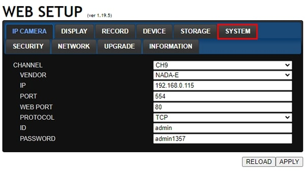
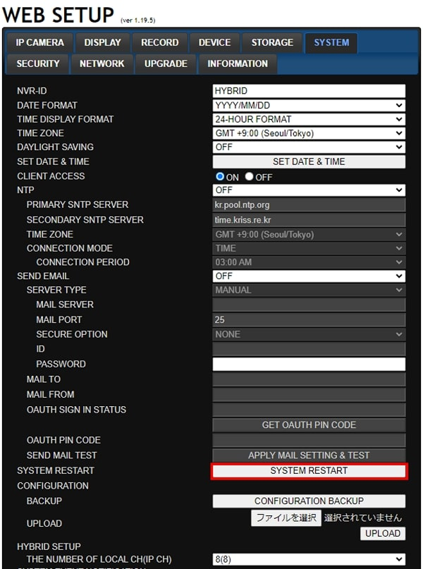
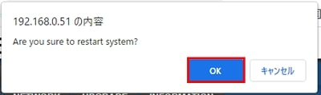

# レコーダーを再起動する

[[toc]]

## UMSからレコーダーの設定画面を開く

UMSを立ち上げ、Connectをクリックします。

以下の項目を入力し、OKをクリックし、レコーダーに接続します。
- モデル：DVR／NVR
- 接続先アドレス：レコーダーのIPアドレス
- ポート番号：レコーダーのポート番号
- ID：admin
- パスワード：レコーダーのパスワード

レコーダーに接続したら、画面を右クリックし、遠隔設定をクリックします。

## レコーダーの設定画面からレコーダーを再起動する

ウェブブラウザが立ち上がります。

ユーザー名とパスワードを入力し、サインインをクリックします。
- ユーザー名：admin
- パスワード：レコーダーのパスワード

レコーダーの管理画面にログインしたらSYSTEMタブをクリックします。

SYSTEM RESTARTをクリックします。

確認ダイアログが表示されます。
OKをクリックします。

レコーダーが再起動します。