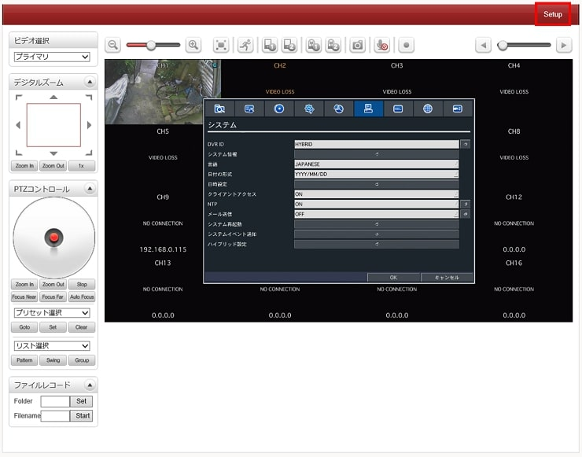
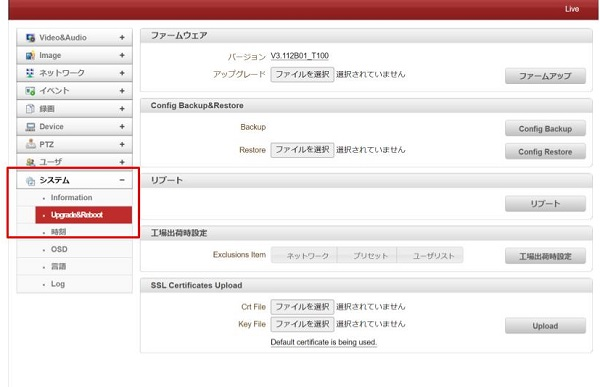

# configファイルの取得

[[toc]]

## はじめに
Configファイルをバックアップすることで、Set Upの設定を保存し、復元させることができます。たとえば以下の用途で活用することができます。

・製品の動作がおかしくなって一度初期化処理を実施した後に、初期化前の設定に戻したい時（configファイルをバックアップしておけばconfigファイル読み込むだけで前の設定に戻せる）
・製品が故障して代替品に取り替えるとき
・同じ設定で複数台使うとき

ここでは、そんなconfigファイルの取得・復元方法について解説を行います。

## configファイルの取得方法

①Set upボタンをクリックして設定画面に入ります。

②メニュー画面からシステム＞Upgrade&Rebootを選択します。

③Config Backup＆Restore内のConfig Backupボタンを押してファイルをダウンロードします。

## configファイルの復元方法

①Config Backup＆Restore内の「ファイルを選択」をクリックし、保存したConfigファイルを選択します。

②Config Restoreボタンを押してファイルをダウンロードします。

こちらの画像が出れば完了です。

**注意！ファームウェアのバージョンが同じでないとうまくダウンロードできません。** 

もしうまくダウンロードができなかった場合（バージョンが合わなかったとき）はバージョン情報をアイゼックまでご連絡下さい。お客様のバージョンに合ったファームウェアをおくりますので、ファームウェアアップデートをお願いします。
**ファームウェアアップデート方法は[こちら](./common-firmware-update.html)**

**H.２６５圧縮形式対応 最新の画像伝送装置はこちら▼**
- [【映像、音声、シリアルの3種類の信号を同時に伝送】エンコーダ、デコーダ兼用機 製品ページ](https://isecj.jp/transfer/lan-uhd265ed)

- [【4台のIPカメラの映像をモニタ表示】デコーダ 製品ページ](https://isecj.jp/transfer/lan-uhd265d-1)

- [【HDMIパススルー出力可能】エンコーダ 製品ページ（今冬販売開始予定）]()

