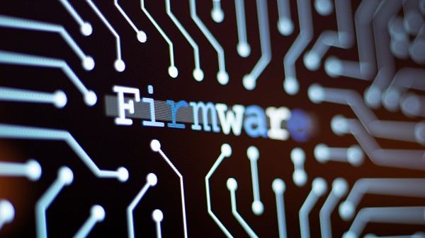
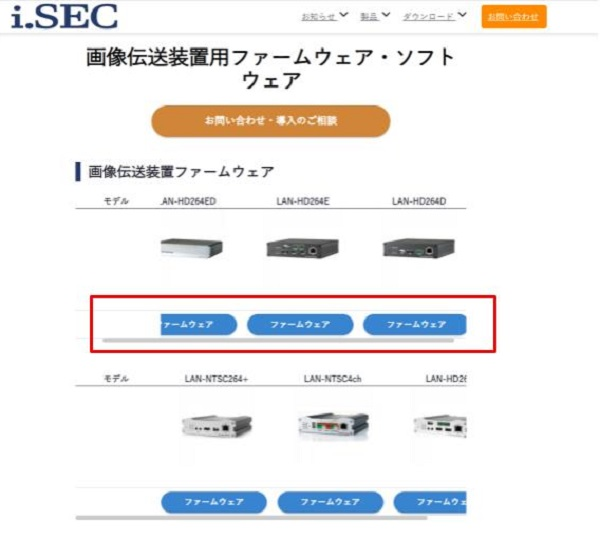
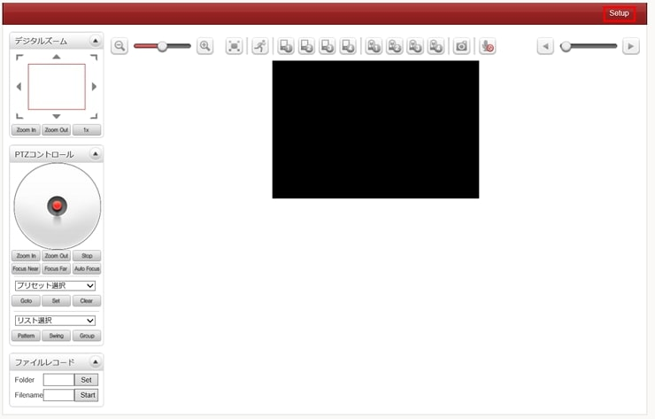
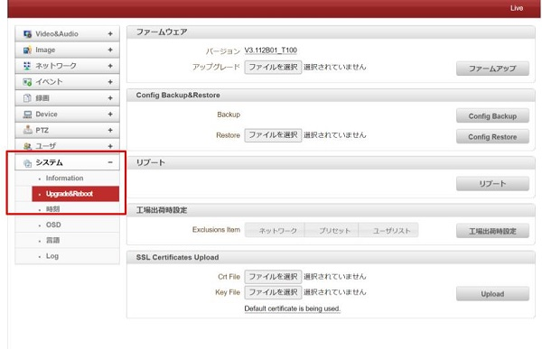
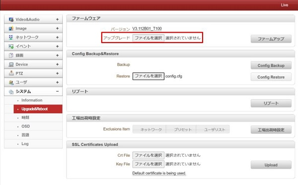
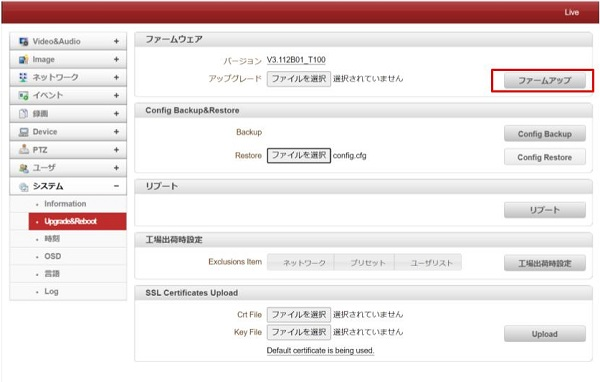

# ファームウェアアップデート

LAN-HD264シリーズでは定期的なファームウェアのアップデートをお願いしております。
以下の手順に従ってアップデートを行ってください。

[[toc]]

## 事前準備
最新ファームウェアは[こちら](https://isecj.jp/page/software/software-transfer-firmware)からダウンロードください。

## アップデート手順

1. LAN-HD264Dの設定画面を開きます。設定画面を開く方法は[こちら](./decoder-264d-setup.html#%E3%82%A6%E3%82%A7%E3%83%95%E3%82%99%E8%A8%AD%E5%AE%9A%E7%94%BB%E9%9D%A2%E3%81%AB%E3%83%AD%E3%82%AF%E3%82%99%E3%82%A4%E3%83%B3)参照してください。
   
右上の「Setup」をクリックします。

2.  システム⇒Upgrade＆Rebootを選択してください

3. アップグレードのファイルの選択をクリックし、先ほどダウンロードしたファームウェアを選択してください

4. ファームアップを押して10～15分ほどお待ちください。

**ファームウェアのアップグレードは10分以上かかることがあります。その間にブラウザを閉じたり更新を行わないようご注意ください**

**H.２６５圧縮形式対応 最新の画像伝送装置はこちら▼**
- [【映像、音声、シリアルの3種類の信号を同時に伝送】エンコーダ、デコーダ兼用機 製品ページ](https://isecj.jp/transfer/lan-uhd265ed)

- [【4台のIPカメラの映像をモニタ表示】デコーダ 製品ページ](https://isecj.jp/transfer/lan-uhd265d-1)

- [【HDMIパススルー出力可能】エンコーダ 製品ページ（今冬販売開始予定）]()