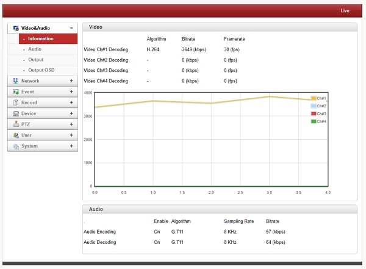

# 基本のセットアップ

[[toc]]

## はじめに

LAN-HD264EとLAN-HD264Dはアナログ、HD-SDI、HD-MDIの映像のどれか一つと音声、シリアル信号を一緒にLanケーブルで伝送が可能です。 LANケーブルで遠隔地に伝送する際の基本的なLAN-HD264EとLAN-HD264Dの設定についてご紹介します。

**今回の接続では、上記のようなシステム構成でカメラの映像をLAN-HD264Eでエンコードしインターネット経由で伝送、遠隔地でLAN-HD264Dでデコードしなおしてモニタに出力する場合を想定しています。**

## １.LAN-HD264E（エンコーダー）の設定

LAN-HD264Eを取り出したらLANケーブルと映像ケーブル（HDMIや同軸ケーブル等）を接続します。本機はPoE対応のため、PoEハブからLANケーブルを接続すると電源が供給されます。

PoE非対応のハブを使用する場合は電源ケーブルを本体に接続してください。

**PoE給電と電源ケーブルの両方を接続すると故障しますので絶対に両方を接続しないよう注意ください**

### 1. IPアドレス変更
本機のデフォルトのIPアドレスは192.168.10.100です。ローカルネットワークのIPアドレスが192.168.10.XXXではない場合はTrue Managerを使ってIPアドレスを変更します。

True Managerは[こちら](https://isecj.jp/download/?category=%E3%82%BD%E3%83%95%E3%83%88%E3%82%A6%E3%82%A7%E3%82%A2&product=TrueManager)からダウンロードして、インストールしてください。

True Managerを立ち上げたらServer＞IP Discoveryをクリックします。

ネットワーク内のデバイスが検出されます。IPアドレスが192.168.10.100のデバイスを選択し、IP Changeをクリックします。

IPアドレスを変更したらブラウザを立ち上げアドレスバーにIPアドレスを入力します。
入力が完了したらChangeをクリックします。

#### 固定IPでの接続方法

- IP Mode：Fixed IP（固定IP）を選択します。
- IP Address：IPアドレスを入力します。
- Subnet Mask：255.255.255.0を入力します。
- Gateway：ゲートウェイ（ルーター）のIPアドレスを入力します。
- Base Port：初期値は2222です。
- HTTP Port：初期値は80です。

#### DHCPでの接続方法

- IP Mode：DHCP（動的IP）を選択します。
- IP Address：入力不要です。
- Subnet Mask：入力不要です。
- Gateway：入力不要です。
- Base Port：初期値は2222です。
- HTTP Port：初期値は80です。

 

IPアドレスを変更してから数十秒後にDiscoverをクリックするとIPアドレス変更後の端末が一覧に表示されます。

追加するサーバーにチェックを入れ、Add Serverをクリックします。

各種項目を入力し、Addをクリックします。

- Server Name：名前を入力します。
- Address：IP Changeで入力した値が入力済です。
- Port：IP Changeで入力した値が入力済です。
- HTTP Port：IP Changeで入力した値が入力済です。
- ID：adminが入力済です。
- Password：パスワードを入力します。

### 2. ウェブ設定画面にログイン

追加したサーバーにチェックを入れます。

IDとパスワードが正しい場合、ステータスが「Connected」になります。

右クリックしてWeb Setupをクリックします。

ブラウザが立ち上がるのでIDとパスワードを入力し、ログインをクリックします。
※Edgeで設定画面を見る場合、映像プレビューが見れません。Internet Explorer を使用してください。

ログインに成功すると設定画面が表示されます。
Video&Audio＞Videoをクリックします。

Input Auto Detectをクリックし、グレーアウトされていない解像度をクリックします。

Refreshをクリックすると映像源が自動検知されるので選択します

Applyをクリックすると、プレビュー画面に映像が表示されます。

これでセットアップは完了です。

### 3.エンコーダ側のルータのポート開放（ポートフォワーディング）
エンコーダ側のルータでポート開放（ポートフォワーディング）を実施下さい。本例だとエンコーダのBaseポート22XXとHTTPポート80XXをポート開放します。

＊ポート開放の方法はルータによって異なりますのでお使いのルータ機器の取扱説明書を参照下さい。参考例: [バッファロー製のルーターのポート開放方法](https://www.buffalo.jp/support/faq/detail/8346.html)

## 2.LAN-HD264D（デコーダー）接続設定

LAN-HD264Dを取り出したらLANケーブルを接続します。本機はPoE対応のため、PoEハブからLANケーブルを接続すると電源が供給されます。

PoE非対応のハブを使用する場合は電源ケーブルを本体に接続してください。

**PoE給電と電源ケーブルの両方を接続すると故障しますので絶対に両方を接続しないよう注意ください**

### 1. IPアドレス変更

本機のデフォルトのIPアドレスは192.168.10.100です。ローカルネットワークのIPアドレスが192.168.10.XXXではない場合はTrue Managerを使ってIPアドレスを変更します。

True Managerは[こちら](https://isecj.jp/download/?category=%E3%82%BD%E3%83%95%E3%83%88%E3%82%A6%E3%82%A7%E3%82%A2&product=TrueManager)からダウンロードして、インストールしてください。

True Managerを立ち上げたらServer＞IP Discoveryをクリックします。

ネットワーク内のデバイスが検出されます。IPアドレスが192.168.10.100のデバイスを選択し、IP Changeをクリックします。

IPアドレスを変更したらブラウザを立ち上げアドレスバーにIPアドレスを入力します。
入力が完了したらChangeをクリックします。

#### 固定IPでの接続方法

- IP Mode：Fixed IP（固定IP）を選択します。
- IP Address：IPアドレスを入力します。
- Subnet Mask：255.255.255.0を入力します。
- Gateway：ゲートウェイ（ルーター）のIPアドレスを入力します。
- Base Port：初期値は2222です。
- HTTP Port：初期値は80です。

#### DHCPでの接続方法

- IP Mode：DHCP（動的IP）を選択します。
- IP Address：入力不要です。
- Subnet Mask：入力不要です。
- Gateway：入力不要です。
- Base Port：初期値は2222です。
- HTTP Port：初期値は80です。

IPアドレスを変更してから数十秒後にDiscoverをクリックするとIPアドレス変更後の端末が一覧に表示されます。

追加するサーバーにチェックを入れ、Add Serverをクリックします。

各種項目を入力し、Addをクリックします。

- Server Name：名前を入力します。
- Address：IP Changeで入力した値が入力済です。
- Port：IP Changeで入力した値が入力済です。
- HTTP Port：IP Changeで入力した値が入力済です。
- ID：adminが入力済です。
- Password：パスワードを入力します。

### 2. ウェブ設定画面にログイン

追加したサーバーにチェックを入れます。

IDとパスワードが正しい場合、ステータスが「Connected」になります。

右クリックしてWeb Setupをクリックします。

ブラウザが立ち上がるのでIDとパスワードを入力し、ログインをクリックします。
※Edgeで設定画面を見る場合、映像プレビューが見れません。Internet Explorer を使用してください。

ログインに成功すると設定画面が表示されます。
Network＞Remoteをクリックします。

### 3. エンコーダーと接続

Remote#〇 にLAN-HD264EのIPアドレスやポート番号を入力し、適用をクリックします。

<設定項目>
- Remote Type：Normalを選択します。
- Media Protocol：TCPを選択します。
- Address：LAN-HD264EのIPアドレスを入力します。
- Port：LAN-HD264Eのポート番号を入力します。
- Remote Channel：Channel#1を選択します。
- Use Streaming Server：Off
- SS IP Address：初期値0.0.0.0。設定しません。
- SS Port：初期値2222。設定しません。
- ID：adminを入力します。
- Password：LAN-HD264Eのパスワードを入力します。
- Overlapped Connection：Disableを選択します。

接続が成功するとVideo＆MediaのInformation画面に中継中の映像のビットレートやfpsが表示されます。

画面右上のLiveをクリックすると、ライブ映像が表示されます。

これでセットアップは完了です。

**H.２６５圧縮形式対応 最新の画像伝送装置はこちら▼**
- [【映像、音声、シリアルの3種類の信号を同時に伝送】エンコーダ、デコーダ兼用機 製品ページ](https://isecj.jp/transfer/lan-uhd265ed)

- [【4台のIPカメラの映像をモニタ表示】デコーダ 製品ページ](https://isecj.jp/transfer/lan-uhd265d-1)

- [【HDMIパススルー出力可能】エンコーダ 製品ページ（今冬販売開始予定）]()