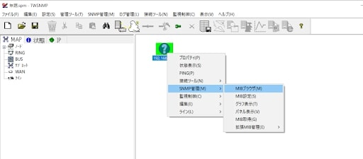

# SNMP機能で機器の状態を監視する

  
LAN-HD264シリーズでは、SNMP機能をつかって画像伝送装置の状態を監視する事ができます。

## 接続手順

1. TWSNMPを立ち上げます
  

2. 管理ツール＞ノード検索をクリックします
  

3. 開始アドレス、終了アドレスを入力する。
今回はIPアドレス192.168.0.72のノードを追加したいので両方とも192.168.0.72を入力する。
  

4. ノードが追加されるので右クリック＞SNMP管理＞MIBブラウザをクリックしていきます
  

5. 追加をクリックします
  

6. enterprises を選択し、選択をクリックします
  

7. 実行をクリックします
  

8. MIB情報が出力されるので、保存をクリックし、取得結果のテキストファイルを保存します
  

9. 出力結果とMIB定義ファイルを見比べます
MIB定義ファイルとは？
MIB定義ファイルはKEX-MIB.TXTとKEX-TABLE-MIB.TXTの二種類が存在する。
KEX-MIB.TXTが先に読み込まれる。
出力結果4行目のV3.005B01_T100を見て、FWのバージョンだとわかればK	EX-MIB.TXTの赤枠部分がシステム関係のステータスであるとわかる。
  

同様に出力結果の下2桁が4行ごとに1ずつ増加して18まで増えている行がある。
KEX-TABLE-MIB.TXTではchStatusEntryが18まで定義されているのでenterprises.40686.1.2.3.1.xxはchStatusEntry関係の出力結果と推測できる。
  

7番目の"chCurBitRate"と11番目の"chCurFrameRate"がbpsとfpsの値と推測できる。
  

192.168.0.72のブラウザ設定画面でもほぼ同じ値のbpsとfpsが確認できたので取得したいOIDは上画像の赤枠で囲った部分であると絞りこめる。

**H.２６５圧縮形式対応 最新の画像伝送装置はこちら▼**
- [【映像、音声、シリアルの3種類の信号を同時に伝送】エンコーダ、デコーダ兼用機 製品ページ](https://isecj.jp/transfer/lan-uhd265ed)

- [【4台のIPカメラの映像をモニタ表示】デコーダ 製品ページ](https://isecj.jp/transfer/lan-uhd265d-1)

- [【HDMIパススルー出力可能】エンコーダ 製品ページ（今冬販売開始予定）]()

