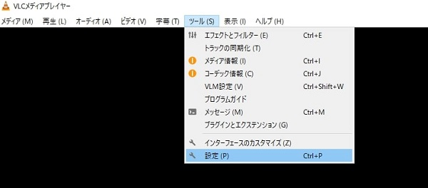

# SRT接続で映像を送る

SRT接続は最新の映像伝送方式でTCPなどに比べてより安定して高品質な映像を伝送できる方式です。（詳細は記事参照：https://isecj.jp/page/blog/srt）
またこの方式で映像伝送する場合、データを暗号化して送る事も可能なのでセキュリティ対策をしつつ高品質な映像を送りたい場合に活用することができます。ここではそんなSRT接続の設定方法を紹介します。

[[toc]]

## LAN-HD-264E側の設定

1. 左メニューからネットワーク⇒SRTに移動します

2. 各項目を設定していきます。

|  項目   |  意味/推奨設定   |
| ---- | ---- |
|  Primary   |  Listener  |
|  Listen Port   |  任意のポート番号を入力（本例では1500)  |
|  Secure   |  暗号通信を使いたい場合、AES-128かAES-256を選択。不使用ならOFF |
|  Passphrase   |  Secureでoff以外を選択すると表示され、任意のパスワードを入力する  |
|  Latency   |  遅延時間の設定（60～8000msec）で設定可能。なるべく遅延を少なくしたいなら短い時間に設定　（長い時間に設定すると不安定なネットワークでパケットロスが大量発生した際も高画質な映像が送れます）  |

3. 項目を入力後、適用を選択します。

4. ポート開放をします。
LAN-HD264Eを設置している場所のルーターでポートを開放してください。
開放するポートはListen Portに設定した任意のポート（本例では3000)です。

以上でLAN-HD264E側の設定は完了です。

## LAN-HD-264D側の設定

1. ネットワーク⇒リモートを選択します。

2. 各項目を設定していきます。

|  項目   |  意味/推奨設定   |
| ---- | ---- |
|  Remote Type   |  SRT  |
|  Mode   |  Caller  |
| アドレス  |  LAN-HD264Eを設置している場所のグローバルＩＰを入力
ローカルネットワーク内での接続の場合はLAN-HD264EのIPアドレスを入力 |
|  ポート   |  LANーHD264Eで設定したポート番号（本例では3000)  |
|  Secure  |  LANーHD264Eで設定していたら入力  |
|  Passphrase   |  LANーHD264Eで登録した任意のパスワードを入力する  |
|  Latency  |  遅延時間の設定（60～8000msec）で設定可能。なるべく遅延を少なくしたいなら短い時間に設定　（長い時間に設定すると不安定なネットワークでパケットロスが大量発生した際も高画質な映像が送れます）  |

3.  項目を入力後、Applyを選択します。

LAN-HD264E,LAN-HD264Dどちらも設定が間違ってないければ接続できます。

## VLCプレーヤーで再生する方法

受信側はLAN-HD264DではなくVLCプレーヤなどでも可能です。

1. VLCプレーヤのメニューから「ツール」⇒設定を選択します。

2. ポップアップが表示されるので左下の設定の表示で「すべて」を選びます。

3. 表示が変わったら、その中から入力／コーデック⇒アクセスモジュールを選択します。

4. ハンバーガーメニュー内にSRTがあるので選択します。

5. 右側にストリーム暗号化のパスワードが表示されるので、そこにLAN-HD264Eで設定したパスワードを入力します。

6. 右下の保存を押します。

7. 次に上部メニューから「メディア」⇒「ネットワークストリームを開く」を選択します。

8. 「メディアを開く」というポップアップが表示されるのでネットワークURLを入力します。
URLは
srt://LAN-HD264EのIPアドレス:LAN-HD264EのSRTポート/video1
です。入力したら再生を押します。

9. 映像が再生できます。

**H.２６５圧縮形式対応 最新の画像伝送装置はこちら▼**
- [【映像、音声、シリアルの3種類の信号を同時に伝送】エンコーダ、デコーダ兼用機 製品ページ](https://isecj.jp/transfer/lan-uhd265ed)

- [【4台のIPカメラの映像をモニタ表示】デコーダ 製品ページ](https://isecj.jp/transfer/lan-uhd265d-1)

- [【HDMIパススルー出力可能】エンコーダ 製品ページ（今冬販売開始予定）]()