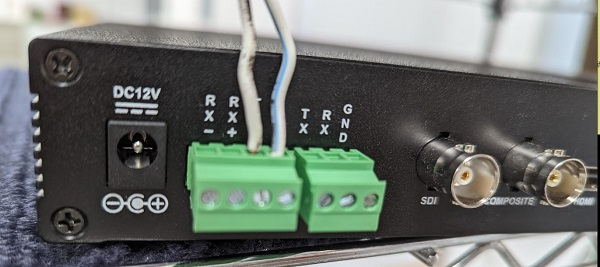
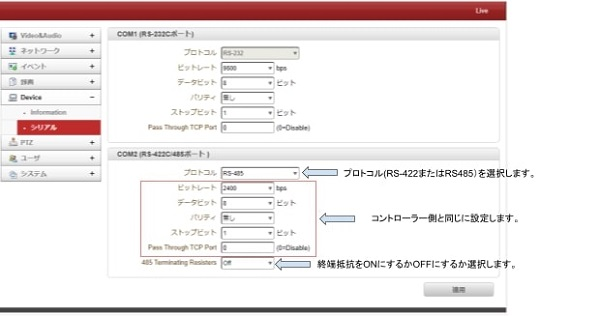
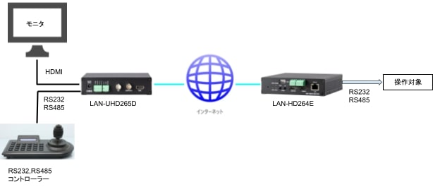
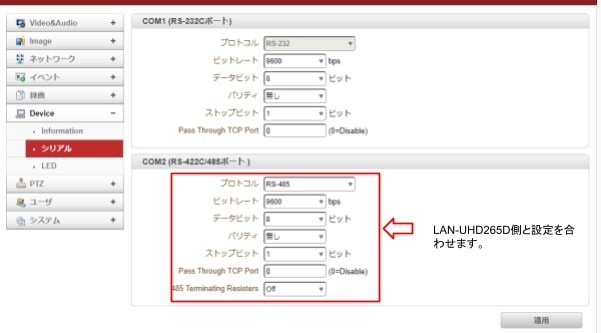
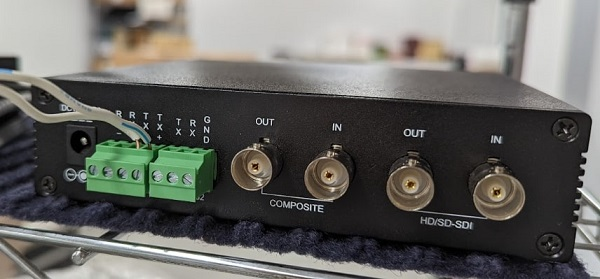
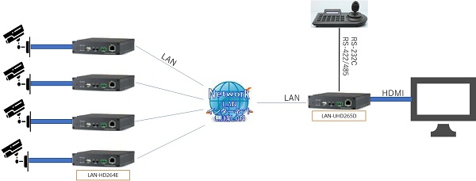
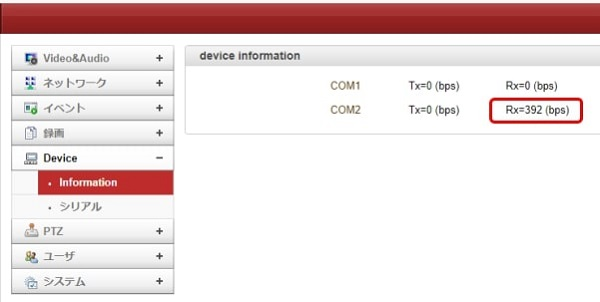
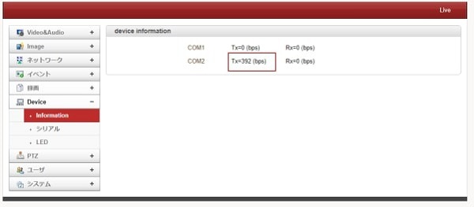
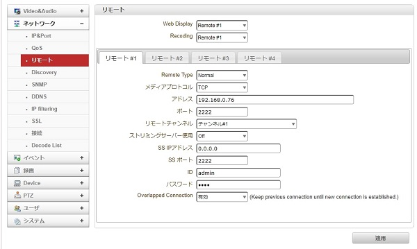

# RS-232/RS-485伝送方法

[[toc]]

## はじめに
LANシリーズにはRS232及びRS485用の接続端子がついており、インターネット経由での伝送が可能です。
ここではRS232及びRS485の伝送方法の手順をRS485での実例で紹介します。

※検証環境：
下記のようなシステム構成です。
遠隔で映像を監視しながら
LAN-UHD265D⇒インターネット⇒LAN-HD264E
を経由して操作対象へRS232、RS485を伝送します。

## 手順

1. コントローラーとLAN-UHD265Dを接続する
コントローラーのRS-485信号線を有線でLAN-UHD265DのRS-485端子へ接続します。
（信号の＋極は＋の端子に、－極は－の端子に接続します）

2. LAN-UHD265Dの内部設定を設定する
ブラウザでLAN-UHD265Dにログインし左メニューよりDevice＞シリアルを選択し信号情報を入力します。

3. 設定をコントローラー側と正しく合わせる事ができれば、Device＞Informationにてコントローラー側から信号を送った際にビットレートがたちます。

4. ネットワーク＞リモートを選択し、接続先のLAN-HD264Eの情報（IPアドレスやパスワード）を入力、「適用」をクリックします。

5. LAN-HD264E側でも同様にDevice＞シリアルをLAN-UHD265Dと同じ設定にします。

6. 設定が合っていれば、コントローラーで操作した信号がLAN-UHD265⇒インターネット⇒LAN-HD264Eの流れで伝送されます。
信号を受信しているかはDevice⇒Informationで確認できます。

7. 本例ではTX側にて信号を受信しているのでTX＋とTX－の端子にケーブルを接続します。

## よくある質問
質問：
下記図のようにLAN-UHD265Dに複数台のLAN-HD264Eを接続した場合、接続した全てのLAN-HD264Eに信号が行きますか？

答：
はい、全てのLAN-HD264Eに信号がいきます。
信号を送りたくない機器がある場合、⑤のシリアル情報の設定をLAN-UHD265D側と違う値（例えばビットレートをLAN-UHD265Dは2400bpsだったらLAN-HD264E側は9600bpsにするなど）すれば信号は伝送されません。

**H.２６５圧縮形式対応 最新の画像伝送装置はこちら▼**
- [【映像、音声、シリアルの3種類の信号を同時に伝送】エンコーダ、デコーダ兼用機 製品ページ](https://isecj.jp/transfer/lan-uhd265ed)

- [【4台のIPカメラの映像をモニタ表示】デコーダ 製品ページ](https://isecj.jp/transfer/lan-uhd265d-1)

- [【HDMIパススルー出力可能】エンコーダ 製品ページ（今冬販売開始予定）]()
