# USBに録画する

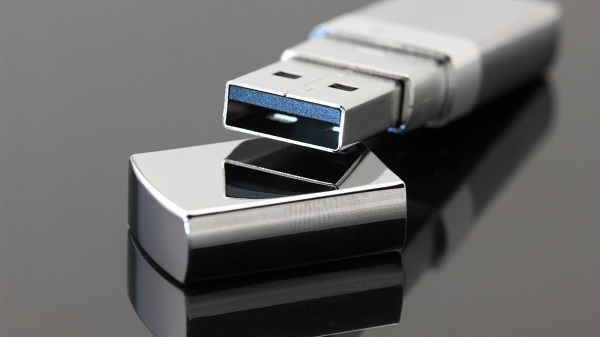

LAN-HD264シリーズはUSBポートがついており、外付けHDやUSBを接続することで映像を録画することができます。ここではUSBを用いた録画の方法を紹介します。

[[toc]]

## USBのフォーマットを行う

1. LAN-HD264のUSBポートにUSBを接続します

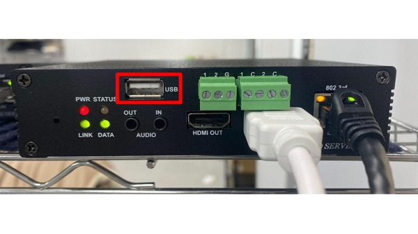

2. LAN-HD264のWEBセットアップ画面を開きます。設定画面を開く方法は[こちら](./decoder-264d-setup.html#%E3%82%A6%E3%82%A7%E3%83%95%E3%82%99%E8%A8%AD%E5%AE%9A%E7%94%BB%E9%9D%A2%E3%81%AB%E3%83%AD%E3%82%AF%E3%82%99%E3%82%A4%E3%83%B3)を参照してください。

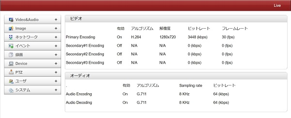

3. 録画＞ディスクインフォメーションに移動します。

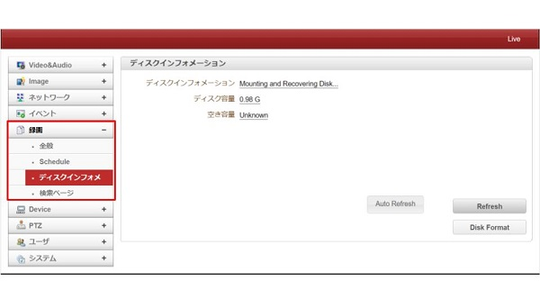

4. 画面右下の「Disk Format」をクリックします。

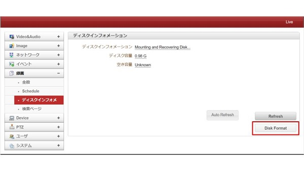

5. 元のデータを削除し、形式を合わせますか？というポップアップが出てきますのでOKをクリックします。

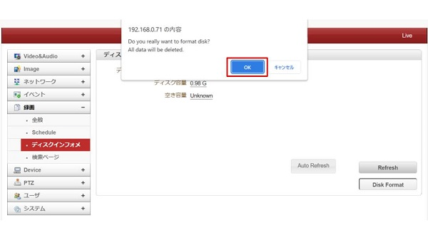

6. 数分待って、「Refesh」をクリックまたはページを更新して、ディスクインフォメーションが「USB Disk available - (FAT32)」になっていれば完了です。

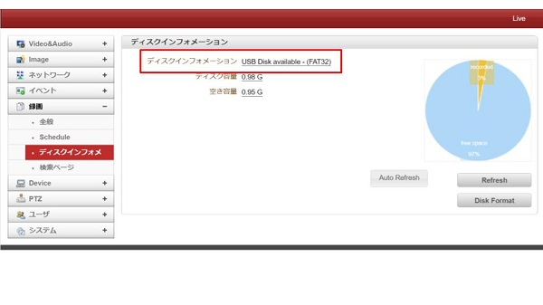

## 録画設定を行う
7. 録画＞全般に移動し、録画をするを「Off」から「Use Disk」に変更します。

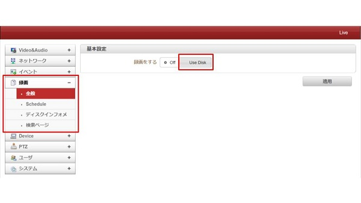

8. 録画の設定項目が表示されるので、各項目を設定していきます。

＜設定する項目一覧＞

|  項目   |  意味   |
| ---- | ---- |
|  Manual Record   |  手動で録画を開始・停止するか  |
|  上書き   |  上書きを自動でするか（データがいっぱいになったとき）  |
|  最大保存容量   |  どのくらいの容量まで１ファイルに保存するか  |
|  Max File Length   |  どのくらいの長さまで１ファイルに保存するか  |
|  Record File Format   |  録画ファイルの形式  |
|  自動でFTPにバックアップ   |  他のサーバーに録画をバックアップするかどうか  |

9. 項目を設定後、右下の「適用」をクリックし、設定を保存します。

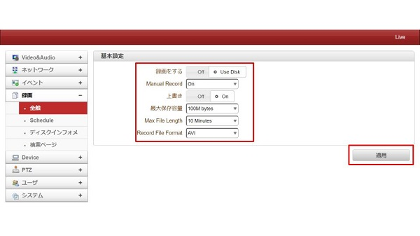

10. 再起動を求めるポップアップが出てきますので、「OK」をクリックします。

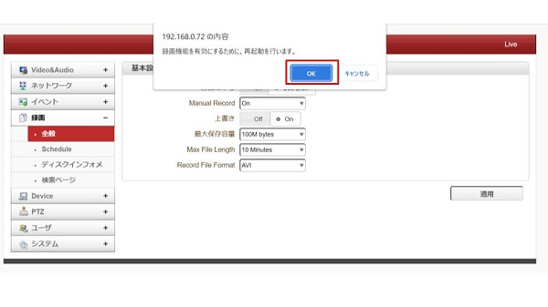

11. 以上で録画の設定は完了です。

＜録画状態の確認＞

録画の状態は、ディスクインフォメーションまたは検索ページより確認ができます。

（USB内に録画されている容量を確認）

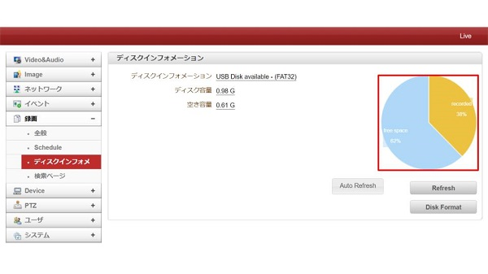

（録画の一覧）

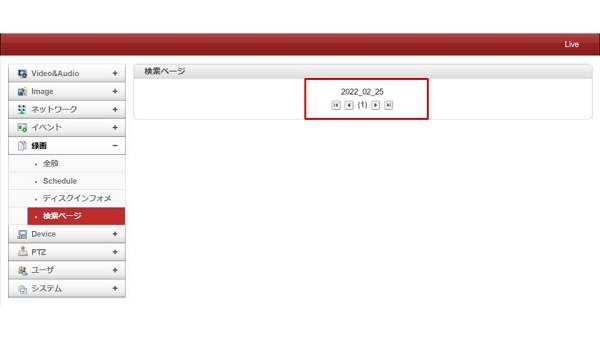

（日付をクリックすると、、より詳細なログを確認できる）

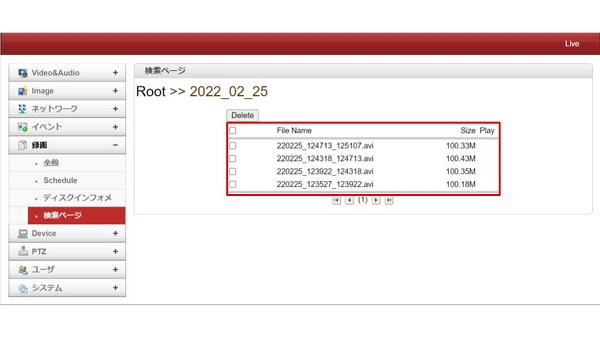

**H.２６５圧縮形式対応 最新の画像伝送装置はこちら▼**
- [【映像、音声、シリアルの3種類の信号を同時に伝送】エンコーダ、デコーダ兼用機 製品ページ](https://isecj.jp/transfer/lan-uhd265ed)

- [【4台のIPカメラの映像をモニタ表示】デコーダ 製品ページ](https://isecj.jp/transfer/lan-uhd265d-1)

- [【HDMIパススルー出力可能】エンコーダ 製品ページ（今冬販売開始予定）]()