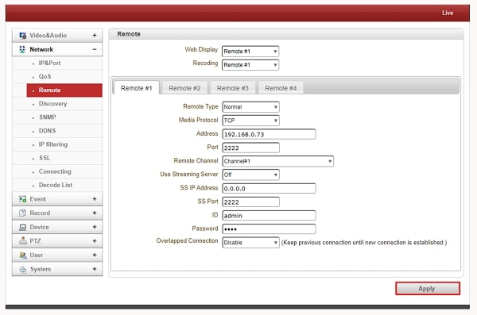
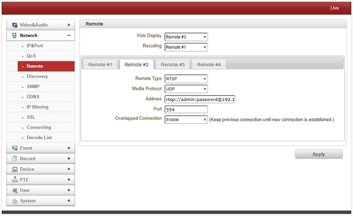

# エンコーダーやIPカメラを複数接続する

LAN-HD264DにはLAN-HD264EやIPカメラを最大4台まで同時に接続することができます。
ここではこのようにエンコーダーやIPカメラを複数接続する方法を紹介します。
[[toc]]

## 接続手順
### 事前準備
- エンコーダーをつなげる場合：
エンコーダのIPアドレス設定、及びポート開放を行ってください。
手順は[こちら](https://isecj.jp/manual/transfer/common-setup.html)参照してください。

- IPカメラを接続する場合：
事前にIPアドレス、ポート番号などを確認してください。

### 1. 設定画面を開く
LAN-HD264Dの設定画面を開きます。設定画面を開く方法は[こちら](./decoder-264d-setup.html#%E3%82%A6%E3%82%A7%E3%83%95%E3%82%99%E8%A8%AD%E5%AE%9A%E7%94%BB%E9%9D%A2%E3%81%AB%E3%83%AD%E3%82%AF%E3%82%99%E3%82%A4%E3%83%B3)参照してください。

ネットワーク設定より、「リモート」タブを選択します。

### 2. それぞれのカメラ、エンコーダーを接続する
リモートタブは全部で４つあり、それぞれに、IPカメラやエンコーダーの情報を記入することで接続が可能です。

#### 2.1 LAN-HD264Eと接続する場合

|  入力項目   |  意味/推奨設定   |
| ---- | ---- |
|  Remote Type   |  Normalを選択 |
|  Media Protocol  | TCPを選択  |
| Address  | LAN-HD264EのIPアドレスを入力|
|  Port   |  LAN-HD264Eのポート番号を入力  |
|  Remote Channel  | Channel#1を選択  |
| Use Streaming Server  | Off |
|  SS IP Address   |  初期値0.0.0.0。設定しません。  |
|  SS Port   |  初期値2222。設定しません。  |
|  ID |  adminを入力 |
|  Password  | LAN-HD264Eのパスワードを入力  |
|  Overlapped Connection |  Disableを選択  |

#### 2.2 IPカメラと接続する場合：
IPカメラはRTSP接続、ONVIF接続の２つの接続方法があります。

- RTSPでIPカメラと接続する場合

|  入力項目   |  意味/推奨設定   |
| ---- | ---- |
|  Remote Type   |  RTSPを選択 |
|  Media Protocol  |  TCPかUDPを選択  |
| Address  | rtsp://IPカメラのID:IPカメラのパスワード@IPカメラのIPアドレス/1/stream1を入力|
|  Port   |  RTSPポート（554）を入力  |
|  ID |  IPカメラのIDを入力  |
|  Overlapped Connection |  EnableまたはDisableを選択  |

 
 
- ONVIFでIPカメラと接続する場合

|  入力項目   |  意味/推奨設定   |
| ---- | ---- |
|  Remote Type   |  ONVIFを選択 |
|  Media Protocol  |  TCPかUDPを選択  |
| Address  |  IPカメラのIPアドレスを入力|
|  Port   |  IPカメラのHTTPポートを入力  |
|  ID |  IPカメラのIDを入力  |
|  Password  |  LIPカメラのパスワードを入力  |
|  Profile |  設定画面右下のGet Profile Listをクリックし、プロファイルを取得 |
|  Overlapped Connection |  EnableまたはDisableを選択  |

IPカメラのHTTPポートはメーカーによって初期値が異なりますが
80,8000,8080が初期値として設定されていることが多いです。

赤枠のすべての項目を入力したら、画面右下の「Apply」をクリックします。

### 3.接続を確認する
Web ViewerのVideo＆AudioよりInformationのタブを選択します。
接続に成功していると以下のように画面に中継中の映像のビットレートや表示されます。チャンネルごとに折れ線グラフの色がわけられているので、どのカメラやエンコーダーが接続されていないのか確認することができます。

接続が確認できない場合は再度リモートに戻り、項目がきちんと入力されているか、最後に「Apply」をクリックしたかを確認しましょう。
 

確認した後は実際に映像に問題がないかを確認しましょう。
右上の「Live」をクリックすると、下図のように接続したカメラやエンコーダーの映像を見ることができます。

これで接続は完了です。
 
**H.２６５圧縮形式対応 最新の画像伝送装置はこちら▼**
- [【映像、音声、シリアルの3種類の信号を同時に伝送】エンコーダ、デコーダ兼用機 製品ページ](https://isecj.jp/transfer/lan-uhd265ed)

- [【4台のIPカメラの映像をモニタ表示】デコーダ 製品ページ](https://isecj.jp/transfer/lan-uhd265d-1)

- [【HDMIパススルー出力可能】エンコーダ 製品ページ（今冬販売開始予定）]()