# 出力される映像を切り替える

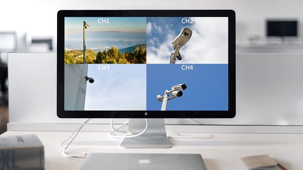

LAN-HD264Dでは、出力映像の表示を自由に切り替えることができます。
映像表示の種類は、４分割、２分割、１画面、ローテーションなどがあります。
ここではそれぞれの表示切替方法について解説を行います。
[[toc]]

## 共通手順

1. デコーダーと、モニターを繋いでいきます。本デコーダーでは、HDMI,SDI,Compositeの３つの方法で接続（出力）が可能です。

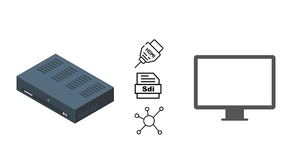

2. デコーダーのwebセッティング画面を開き、Video＆Audioの「Out Put」を選択します。
Display Modeの各項目を設定していきます。
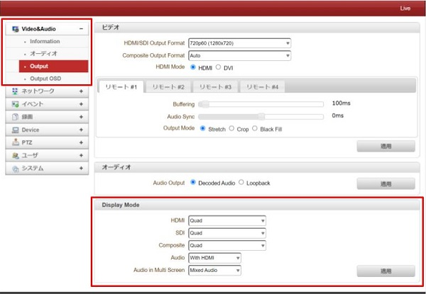

## 画面を４分割にしたい場合

1. 出力したい形式のモードをQuadにし、「適用」をクリックします。(例：HDMI出力→HDMIのみ「Quad」にする)

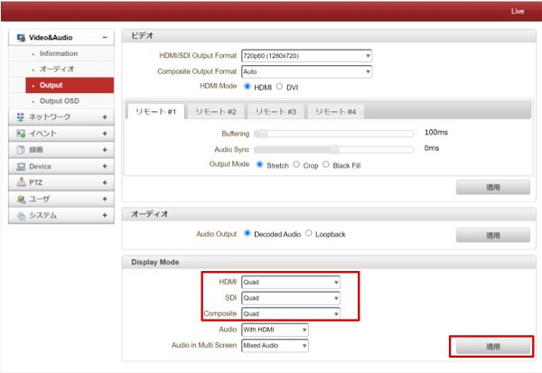

2. モニターを見てみると、下図のように画面が４分割されています。（イメージ図）

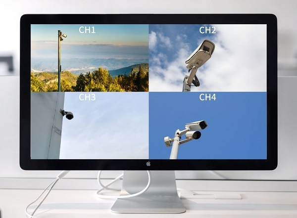

## 画面を２分割にしたい場合
縦に2分割するか横に二分割にするか選ぶことができます。

1. 縦に2分割をしたい場合、Vertical Dualを選択、横に2分割したい場合「Horizontal Dual」を選択してください。

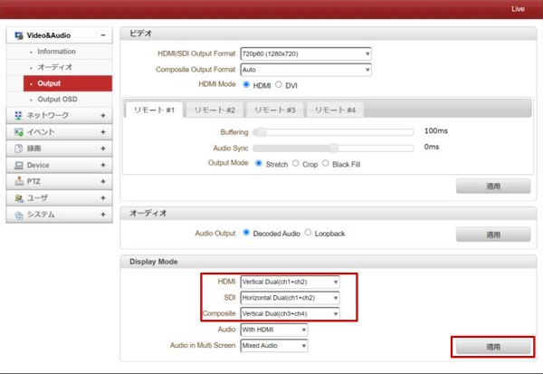

＜２分割したい場合の表示モード一覧＞

|  表示モード   |  意味   |
| ---- | ---- |
|  Vertical Dual(ch1 + ch2)   |  チャンネル１とチャンネル２を縦に表示  |
|  Vertical Dual(ch3 + ch4)   |  チャンネル３とチャンネル４を縦に表示  |
|  Horizontal Dual (ch1 + ch2)   |  チャンネル１とチャンネル２を横に表示  |
|  Horizontal Dual(ch3 + ch4)   |  チャンネル３とチャンネル４を横に表示  |

2. 「適用」後、モニターを見てみると、下図のように画面が２分割されています。（イメージ図）**※ここでのチャンネルは、複数接続の際のリモートと同義です。** 

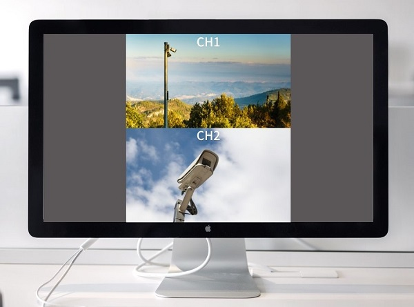
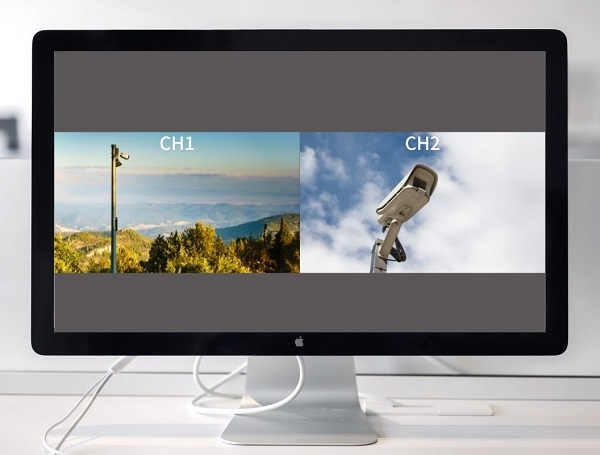

## 特定のチャンネルだけを１画面表示したい場合

1. Channel1〜4の任意のチャンネル番号を選択してください。選択後「適用」をクリックします。**※ここでのチャンネルは、複数接続の際のリモートと同義です。**

2. 「適用」後、モニターを見てみると、下図のように特定のチャンネルのみが1画面で表示されています（イメージ図）

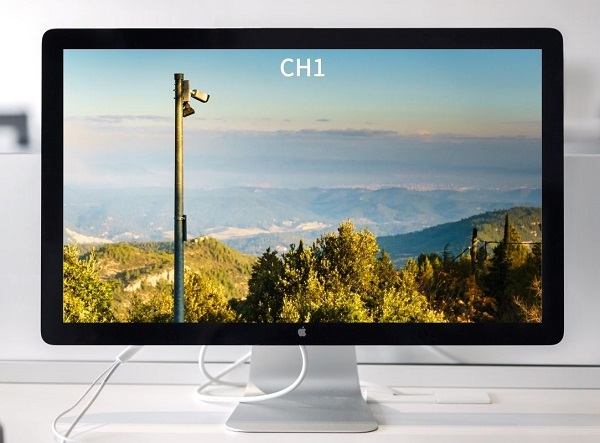

## 各チャンネルをローテーションで切り替えながら表示させたい場合

1. Rotation を選択してください。すると、項目の下に〇Secondsと秒数の選択のタブが出てきます。

2. この秒数は各映像をどのくらいの時間間隔で切り替えるかという意味なので任意の秒数を選択します。選択後、「適用」をクリックします。

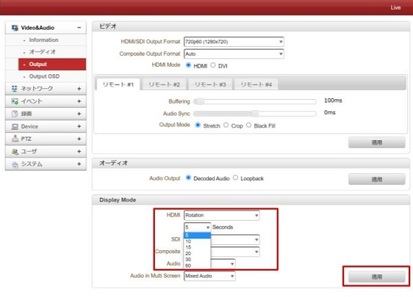

3.「適用」後、モニターを見てみると、下図のように設定した秒数ごとに表示されるチャンネルが変わっていきます。（イメージ図）

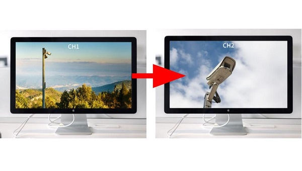

**※WEBブラウザ上の監視画面では、一つのチャンネルしか監視はできません。**

**H.２６５圧縮形式対応 最新の画像伝送装置はこちら▼**
- [【映像、音声、シリアルの3種類の信号を同時に伝送】エンコーダ、デコーダ兼用機 製品ページ](https://isecj.jp/transfer/lan-uhd265ed)

- [【4台のIPカメラの映像をモニタ表示】デコーダ 製品ページ](https://isecj.jp/transfer/lan-uhd265d-1)

- [【HDMIパススルー出力可能】エンコーダ 製品ページ（今冬販売開始予定）]()