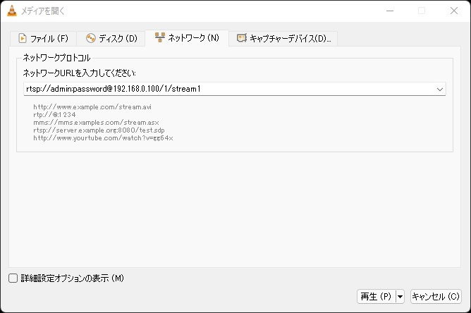

# RTSP接続を行う

## はじめに

LAN-HD264DではRTSP接続で接続が可能です。

RTSPで接続する際の手順は以下の通りです。

[[toc]]

## ①VLCプレーヤーでRTSP接続を確認

本手順は飛ばしても問題ありませんがLAN-HD264Dへ入力するRTSPのアドレスが間違っていない事を簡単に確認できる為、実施される事を推奨致します。

まずVLCプレーヤーを立ち上げます。

（VLCプレーヤーとはオープンソースのプレーヤーでほぼ全てのコーデックに対応した非常に便利なプレーヤーです。[こちら](https://www.videolan.org/vlc/index.ja.html)よりダウンロードが可能です）

次にメニューバーの「メディア」⇒「ネットワークストリームを開く」を選択します。

ポップアップ画面が出てきますので「ネットワークプロコトル」の中にrtspのアドレスを入力します。

弊社のIPカメラの場合、以下の通りです。
- rtsp://ID:password@IPアドレス/1/stream1
- （他社例（axis製カメラの場合）：rtsp://IPアドレス:554/axis-media/media.amp）

rtspのアドレスはメーカによって違うのでご使用のカメラの取扱説明書かメーカへお問い合わせ下さい。

RTSP接続に成功するとIPカメラの映像が表示されます。

## ②LAN-HD264Dの設定

１：Internet ExploreでLAN-HD264Dに接続しセットアップ画面へ移動します。
２：左側のメニューの「ネットワーク」⇒「リモート」を選択し、

- Remote Type：RTSPを選択
- メディアプロコトル：TCPを選択
- アドレス：①のVLCで確認したアドレスを入力
- ポート：IPカメラ側のRTSPポート（標準は554)

を入力し最後に右下の「適用ボタンを押します」

## ③ビットレートの確認

左側メニューのVideo＆Audio⇒Infomationを選択し、ビットレートが0kbps以外でしたら接続が完了です。

Live画面にてPC上で映像をみたり、LAN-HD264Dをモニタに接続してモニタで映像を見ることができます。

**H.２６５圧縮形式対応 最新の画像伝送装置はこちら▼**
- [【映像、音声、シリアルの3種類の信号を同時に伝送】エンコーダ、デコーダ兼用機 製品ページ](https://isecj.jp/transfer/lan-uhd265ed)

- [【4台のIPカメラの映像をモニタ表示】デコーダ 製品ページ](https://isecj.jp/transfer/lan-uhd265d-1)

- [【HDMIパススルー出力可能】エンコーダ 製品ページ（今冬販売開始予定）]()