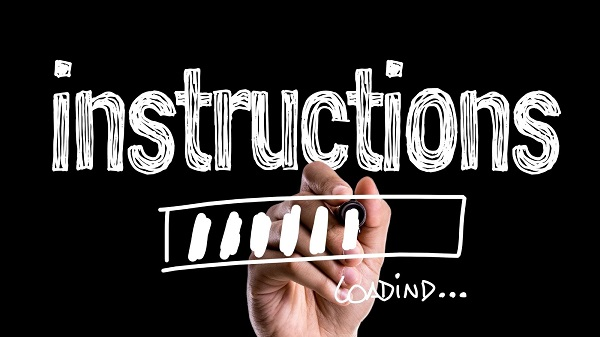
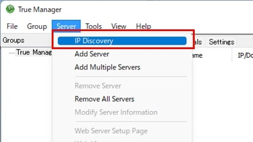
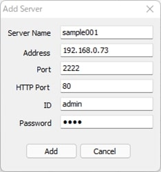
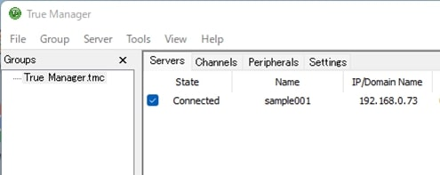
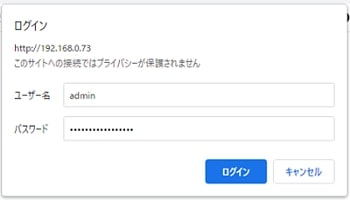
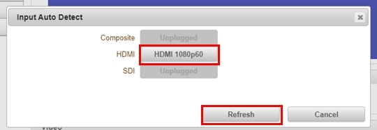

# LAN-HD264Eセットアップ

この記事ではLAN-HD264EにIPアドレスを割り当て、入力した映像を中継可能状態にする手順を説明します。

[[toc]]

## LAN-HD264Eのセットアップ
LAN-HD264Eを取り出したらLANケーブルと映像ケーブル（HDMIや同軸ケーブル等）を接続します。本機はPoE対応のため、PoEハブからLANケーブルを接続すると電源が供給されます。

PoE非対応のハブを使用する場合は電源ケーブルを本体に接続してください。

**PoE給電と電源ケーブルの両方を接続すると故障しますので絶対に両方を接続しないよう注意ください**

## IPアドレス変更
本機のデフォルトのIPアドレスは192.168.10.100です。ローカルネットワークのIPアドレスが192.168.10.XXXではない場合はTrue Managerを使ってIPアドレスを変更します。

True Managerは[こちら](https://isecj.jp/download/?category=%E3%82%BD%E3%83%95%E3%83%88%E3%82%A6%E3%82%A7%E3%82%A2&product=TrueManager)からダウンロードして、インストールしてください。

True Managerを立ち上げたらServer＞IP Discoveryをクリックします。

ネットワーク内のデバイスが検出されます。IPアドレスが192.168.10.100のデバイスを選択し、IP Changeをクリックします。

IPアドレスを変更したらブラウザを立ち上げアドレスバーにIPアドレスを入力します。
入力が完了したらChangeをクリックします。

### 固定IPでの接続方法

- IP Mode：Fixed IP（固定IP）を選択します。
- IP Address：IPアドレスを入力します。
- Subnet Mask：255.255.255.0を入力します。
- Gateway：ゲートウェイ（ルーター）のIPアドレスを入力します。
- Base Port：初期値は2222です。
- HTTP Port：初期値は80です。

### DHCPでの接続方法

- IP Mode：DHCP（動的IP）を選択します。
- IP Address：入力不要です。
- Subnet Mask：入力不要です。
- Gateway：入力不要です。
- Base Port：初期値は2222です。
- HTTP Port：初期値は80です。

 

IPアドレスを変更してから数十秒後にDiscoverをクリックするとIPアドレス変更後の端末が一覧に表示されます。

追加するサーバーにチェックを入れ、Add Serverをクリックします。

各種項目を入力し、Addをクリックします。

- Server Name：名前を入力します。
- Address：IP Changeで入力した値が入力済です。
- Port：IP Changeで入力した値が入力済です。
- HTTP Port：IP Changeで入力した値が入力済です。
- ID：adminが入力済です。
- Password：パスワードを入力します。

## ウェブ設定画面にログイン

追加したサーバーにチェックを入れます。

IDとパスワードが正しい場合、ステータスが「Connected」になります。

右クリックしてWeb Setupをクリックします。

ブラウザが立ち上がるのでIDとパスワードを入力し、ログインをクリックします。
※Edgeで設定画面を見る場合、映像プレビューが見れません。Internet Explorer を使用してください。

ログインに成功すると設定画面が表示されます。
Video&Audio＞Videoをクリックします。

Input Auto Detectをクリックし、グレーアウトされていない解像度をクリックします。

Refreshをクリックすると映像源が自動検知されるので選択します

Applyをクリックすると、プレビュー画面に映像が表示されます。

これでセットアップは完了です。

**H.２６５圧縮形式対応 最新の画像伝送装置はこちら▼**
- [【映像、音声、シリアルの3種類の信号を同時に伝送】エンコーダ、デコーダ兼用機 製品ページ](https://isecj.jp/transfer/lan-uhd265ed)

- [【4台のIPカメラの映像をモニタ表示】デコーダ 製品ページ](https://isecj.jp/transfer/lan-uhd265d-1)

- [【HDMIパススルー出力可能】エンコーダ 製品ページ（今冬販売開始予定）]()