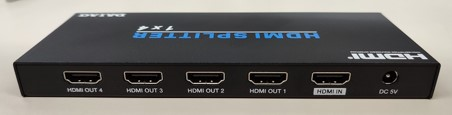
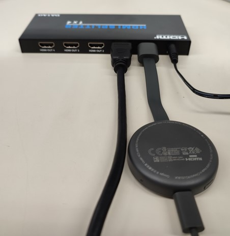
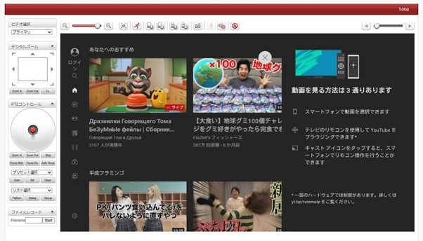
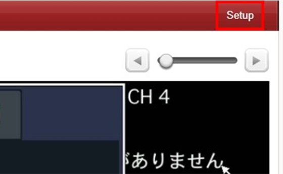
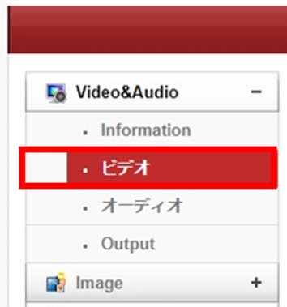
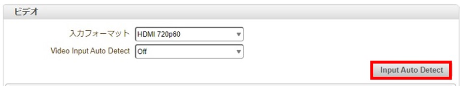
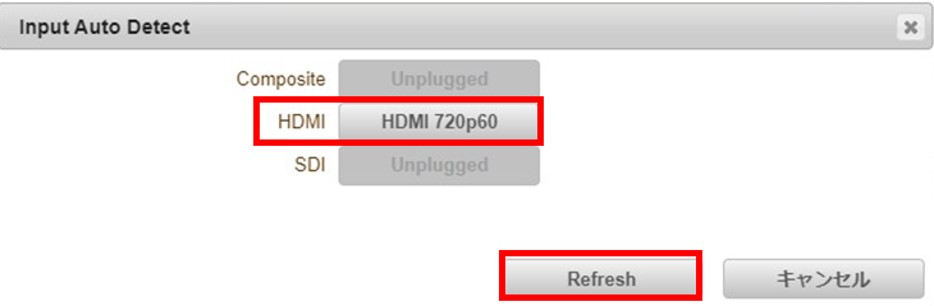
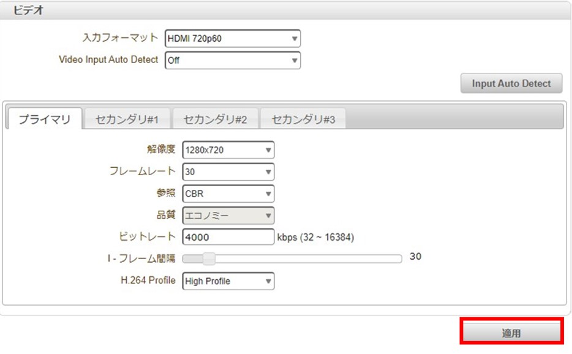

# HDCP 解除

**目次**
[[toc]]

## はじめに

Chromecast のように常時 HDCP オンのデバイスを LAN-HD264E に直接接続すると HDCP（著作権保護機能）により真っ暗な画面が表示されます。

Chromecast は HDCP をオフにすることができないため、映像を伝送する場合は HDCP 解除できるスプリッターを経由させる必要があります。

今回使用したスプリッター
[https://item.rakuten.co.jp/ishin-r/10000036/](https://item.rakuten.co.jp/ishin-r/10000036/)

## HDCP 解除手順

Chromecast をスプリッターの HDMI IN に接続します。

HDMI ケーブルを HDMI OUT に接続し、LAN-HD264E の HDMI IN に接続する。

ライブビュー画面を確認し、真っ黒ではないことを確認します。

## 映像が表示されない場合

映像が表示されない場合はライブビュー画面右上の Setup をクリックします。

Video&Audio のビデオをクリックします。

Input Auto Detect をクリックします。

検出された解像度をクリックし、Refresh をクリックします。

適用をクリックし、設定を保存します。

