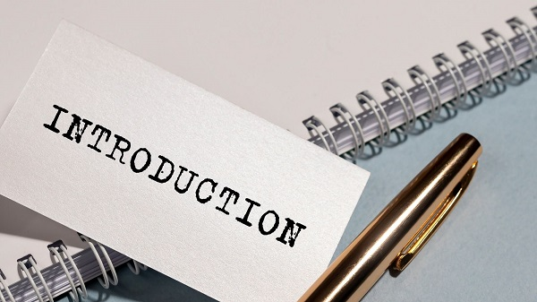

# はじめに

こちらでは、LAN-HD264E（エンコーダー）のセットアップ方法から、さまざまなオプション機能を紹介しております。構成は以下の通りです。
## オンラインマニュアルの構成

### 基本操作

- [セットアップ手順](./encoder-264e-setup.html)

### 便利機能

- [カメラを遠隔操作する](./encoder-remote.html)

- [映像をVLCで見る](./encoder-vlc.html)

- [YouTube Live で映像をストリーミングする](./encoder-streaming.html)

- [映像ではなく画像のみを送る](./encoder-capture-image.html)

**H.２６５圧縮形式対応 最新の画像伝送装置はこちら▼**
- [【映像、音声、シリアルの3種類の信号を同時に伝送】エンコーダ、デコーダ兼用機 製品ページ](https://isecj.jp/transfer/lan-uhd265ed)

- [【4台のIPカメラの映像をモニタ表示】デコーダ 製品ページ](https://isecj.jp/transfer/lan-uhd265d-1)

- [【HDMIパススルー出力可能】エンコーダ 製品ページ（今冬販売開始予定）]()