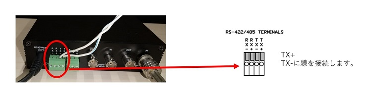

# カメラを遠隔操作する

[[toc]]

## はじめに

LAN-HD264Eはアナログカメラの映像をインターネット経由で遠隔で見る事ができるようにする機器ですがそれ以外にもカメラを遠隔から操作する事も可能です。

LAN-HD264EはRS-485信号出力機能が付いております。

この機能を活用する事でRS-485信号で操作可能なカメラであればLAN-HD264Eで遠隔から操作ができます。

本記事ではLAN-HD264Eとカメラを組み合わせ、遠隔からPCで映像を見たり、カメラのズーム操作を行う方法をご紹介します。

カメラを遠隔から操作する為の手順は以下の通りです。

### 1) RS485信号線を接続する

カメラとRS485信号線をケーブルで接続します。

LAN-HD264E側はTx+とTx-に線を接続します。

### 2) カメラ側にもRS485信号線を接続する

- TX+の線は＋へ
- TX－の線は-へ
  
接続します。＋と－を反対に繋げると通信が上手く行きませんので注意して下さい。

### 3）カメラの映像出力をLAN-HD264Eと同軸ケーブルで接続します。

以上で配線関係は完了です。

### 4）LAN-HD264EにInternetExplorerでアクセスします。

LAN-HD264EとPCの接続方法など詳細についてはこちらの記事を参考下さい　⇒
画面の右上の「Setup」を押してSetup画面に移動します。

### 5)左メニューから「Device」⇒「シリアル」を選択しCOM２をカメラに合わせた設定にします。

今回接続したカメラはRS-485、ビットレートは9600だったのでプロトコルをRS-485にビットレートを9600bpsに設定。

それ以外の項目は初期のままで大丈夫です。

設定が完了したら右下の適用を押します。

### 6)左メニューから「PTZ」⇒「全般」を選択しカメラに合わせた設定にします。

今回接続しているカメラのPTZタイプは「Pelco-D」、PTZIDは「1」なのでそのように設定します。またPTZポートは(5)で設定した通り本例ではCOM2を使用するので「COM2」を選択します。

設定が完了したら右下の適用を押します。

以上で準備完了です。

### 7)右上のLiveをおしてLive画面に移動します。

左下のPTZコンロトールメニューから「Zoom In」 や「Zoom Out」を押すとカメラのズームが動きます。

本例では電動ズームカメラにて遠隔操作機能をご紹介しましたが、RS-485通信で操作可能なPTZカメラであればPTZ操作を実施する事も可能です。

**H.２６５圧縮形式対応 最新の画像伝送装置はこちら▼**
- [【映像、音声、シリアルの3種類の信号を同時に伝送】エンコーダ、デコーダ兼用機 製品ページ](https://isecj.jp/transfer/lan-uhd265ed)

- [【4台のIPカメラの映像をモニタ表示】デコーダ 製品ページ](https://isecj.jp/transfer/lan-uhd265d-1)

- [【HDMIパススルー出力可能】エンコーダ 製品ページ（今冬販売開始予定）]()